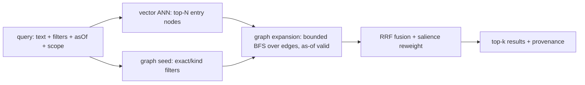

# Retrieval

Purpose: the hybrid recall pipeline (vector ANN candidates → bounded graph expansion → RRF fusion with
salience reweight), typed as-of traversal, the derived/content-addressed/incremental indexing
strategy, and the salience projection.

Source: SPEC §5.

---

## 5.1 Hybrid pipeline (vector candidates → graph expansion → RRF)



```ts
interface RecallQuery {
  text?: string;                      // ADVISORY graph seed: deterministic LEXICAL matching (§5.1a), not
                                      //   exact-only. kip NEVER embeds it (N2).
  embedding?: ReadonlyArray<number>;  // CALLER-SUPPLIED query vector (N2: kip consumes embeddings, never
                                      //   produces them) — the ANN candidate seed. The vector half runs iff
                                      //   present (its model identity MUST match the set-resident
                                      //   kip:embedding-model fact, §5.4/M-7.2); absent ⇒ graph half only,
                                      //   stated, never a silent in-kip embedding call (N5).
  filters?: { kind?: NodeKind[]; props?: Record<PropKey, PropValue>; edgeKinds?: EdgeKind[] };
  scope?: ScopeRef;                   // tenant / namespace / pinned snapshot
  asOf?: AsOf;
  expand?: { hops: number; edgeKinds?: EdgeKind[]; maxFanout?: number }; // bounded — Mem0 precision pitfall
  k: number;
  rank?: { rrfK?: number; salienceWeight?: number; recencyWeight?: number };
}
```

This is the shape consumed by `recall(q)` on the [SDK `Repo` surface](./40-sdk-api-surface.md) and by
the [context-enablement `recall` seam](./25-context-enablement-seams.md).

- **Vector half** (the gap kip fills): ANN over an embedding projection (HNSW or IVF; pluggable index,
  **embeddings supplied by the caller — N2**). Returns candidate entry nodes. **Who embeds the query is
  resolved explicitly (m7-20):** the caller supplies `RecallQuery.embedding` (whose model identity MUST
  match the set-resident `kip:embedding-model` fact, §5.4/M-7.2); `text` is advisory graph-seed input
  only, and kip never invokes an embedder itself (N2/N5 — no silent embedder hook).
- **Graph half**: bounded BFS expansion from candidates over `as-of`-valid edges, with
  `maxFanout` / `hops` caps to fight context dilution. Graph expansion injects tangential noise, so
  expansion **MUST be bounded and opt-in, never unbounded**.
- **Fusion**: **Reciprocal Rank Fusion** `score(d) = Σ_r 1/(rrfK + rank_r(d))` over the vector rank,
  graph-proximity rank, and salience rank. RRF avoids score-scale mismatch between cosine similarity
  and graph distance. The final reweight applies salience/recency knobs.

### 5.1a The `text` graph seed — the shipped, normative contract (D-52)

`text` is not embedded (N2). It is a **deterministic lexical seed** over each candidate node's
searchable surface, and the following is the exact, replica-independent contract kip ships — it is
part of the recall contract, not a tunable.

- **Tokenization.** Explicit `toLowerCase()` (never `toLocaleLowerCase` — locale-independent), split
  on runs of ASCII alphanumerics (`/[a-z0-9]+/g`), dropped through a fixed closed **stopword set**
  (`a, an, and, are, as, at, be, been, but, by, did, do, does, for, from, had, has, have, how, i, if,
  in, into, is, it, its, of, on, or, that, the, their, them, then, there, these, they, this, to, was,
  were, what, when, where, which, while, who, whom, why, will, with, would, you`), and **deduplicated
  into a set** so term FREQUENCY never beats distinct-term COVERAGE. Both the query and each
  candidate's surface are tokenized identically (one shared tokenizer, `src/text-terms.ts`).
- **Candidate surface.** Each node contributes: its `eid` **with the `kip learn` `doc:<blob-oid>#`
  namespace stripped** (so the literal term `doc` and the content-address oid do not match every
  learned node); its node `kind`; **every prop KEY**; the string form of every prop VALUE covering the
  read instant (numbers/booleans stringify; `null`/`BlobRef` values contribute nothing, though their
  key is still indexed); and the `EdgeKind` of every **as-of-valid incident edge** (either direction).
  Indexing prop keys and edge kinds is what lets a relation word ("employer", "owns") anchor a match,
  not only entity names.
- **Scoring.** A candidate's score is the count of **distinct query terms** present in its surface,
  plus a dominant boost (`1_000_000`) iff its `content` prop equals `text` verbatim (the pre-D-52
  exact-content seed, preserved as top rank).
- **Tie-break / ordering.** Total order: score **descending**, then `eid` **ascending**. No clock, no
  randomness, no Map-iteration/arrival-order dependence — two replicas holding the same fact set rank
  identically.
- **The admission bar is LOCAL to the candidate.** A node is seeded iff it is the exact-`content`
  match **or its own surface matches ≥1 distinct query term**. Whether node X is seeded **never**
  depends on what other, unrelated nodes the graph holds (retrieval locality). This deliberately
  replaces the round-2 graph-global floor (`bestMatched >= 2`), which was non-local: it suppressed
  correct single-term subject matches when nothing else in the graph matched ≥2 terms (a silent false
  negative — itself a "surfaced, never silent" violation, docs/27 §0), and collapsed the instant any
  coincidental ≥2-term node appeared (so it provided no fabrication protection). The
  fabrication guard that bar was reaching for now lives in graph-QA as a **subject-anchoring relevance
  check on the retrieved evidence** (kip-graph-qa.md §6.1b), which is where the question's subject and
  the retrieved facts can actually be compared — not in the retrieval floor.
- **Seed cap.** At most `k` seeds are admitted (the ranked prefix); the graph half then expands from
  them under the `expand` bounds.
- **`k`.** REQUIRED and a positive integer BOUND — `k <= 0`, non-integer, or non-number **throws**
  `ERR_MALFORMED_INPUT` (never silently repaired; a negative `k` would otherwise index from the end of
  the result array and return a wrong answer wearing a right shape).
- **asOf.** Every surface read (prop covering values, incident edge validity) is taken at the same
  resolved gate instant the rest of the pipeline reads at, so valid-time/asOf semantics are unchanged:
  a prop value not yet valid, or an edge invalid at the instant, contributes nothing to the surface —
  the seed set and its ranked order can differ across two `asOf` instants.
- **Honest scope.** This is keyword matching, not semantic/embedding retrieval — a question sharing no
  lexical term with the graph's surface correctly seeds nothing.

---

## 5.2 Graph traversal

Typed, directional, **as-of** BFS/DFS with a seen-set (a bitemporal adjacency model), driven by
`query(spec: TraversalSpec)` — the canonical **`TraversalSpec`** shape is declared in the
[SDK API surface "Supporting API types"](./40-sdk-api-surface.md#supporting-api-types-normative).
**Traversal bounds are mandatory `TraversalSpec` fields (m7-21):** `depth` and `maxFanout` MUST be
declared by the caller (no unbounded default exists), and this declared bound is exactly the one
[INV-A10(c)](./60-conformance-and-testability.md) enforces for Discoverer traversal
([mining/discovery §5b.3](./33-mining-discovery-ingestion.md)). Traversal
**only** crosses edges **valid at the query's `validTime`** and **known as-of its `txTime`**. The
bitemporal axes are defined in
[Temporality & bitemporality](./23-temporality-and-bitemporality.md). **Lens caveat:** a traversal
bounded by `asOf.txTime` is a **per-replica belief-audit read** — explicitly **non-convergent**
([temporality §2.1](./23-temporality-and-bitemporality.md)); only a `validTime`-bounded traversal is
convergent. A recall/traversal under a `txTime` bound inherits that non-convergence.

---

## 5.3 Indexing strategy — derived, content-addressed, incremental

(HP-2, T-3, **M-7** — resolved.) **All indexes are projections; none is the source of truth.** kip
splits projections into two classes with **different reproducibility contracts**:

| Class | Members | Reproducibility |
|---|---|---|
| **Deterministic** | `/heads`, graph adjacency, salience-with-fixed-weights **over an exactly-specified integer/rational centrality algorithm** | **Byte-identical** across replicas for equal source (INV-5 applies). |
| **Accelerator (non-deterministic)** | ANN index (HNSW/IVF), embedding vectors, **and any salience whose centrality term uses a floating/iterative-tolerance algorithm** (e.g. power-iteration PageRank) | **Best-effort ranked**; reproducible *only* given the same build. Byte-identity is **explicitly NOT guaranteed** (INV-5 excludes these). |

This deterministic-vs-accelerator boundary is load-bearing for convergence — see §3.5a/§5.3 in
[the git substrate](./22-git-substrate.md) and
[non-functional requirements](./11-non-functional-requirements.md).

- **Keying.** Each projection chunk is keyed by the **git hash of its source subtree** (a shard) or
  the source fact CIDs, cached under `refs/kip/projections/<name>@<srcHash>`. **For accelerators, the
  key MUST also include the embedding-model identity** (model id + version, recorded as a fact, §5.4)
  so "same source, different embedding model" is a cache miss, not silent staleness (M-7.2).
- **Incremental rebuild.** On a new commit, diff the tree (prolly-style subtree-hash skip): only
  changed shards reproject. Embeddings recompute only for entities whose embedded content changed.
- **ANN is not byte-deterministic (M-7.1).** HNSW layer assignment and IVF k-means init are
  order/seed-dependent; two builds over the same vectors can yield different graphs. kip does **NOT**
  claim byte-identity for the ANN index. Its conformance test is **recall-based** ("equivalent up to
  index nondeterminism"), not byte equality. A *fixed-seed* build is reproducible only on the same
  builder; cross-replica ANN indexes are expected to differ in bytes while agreeing in ranked recall.
- **Cache invalidation = key mismatch.** A chunk is valid **iff** its key (source hash *and*, for
  accelerators, embedding-model id) matches. Staleness of a *deterministic* projection is structurally
  impossible; staleness of an *accelerator* is **detectable** via the model-id component of the key —
  **not** "structurally impossible" (the v1 claim was too strong; corrected, M-7).
- **Rebuildability invariant (INV-5).** Dropping and rebuilding all **deterministic** projections
  yields byte-identical results. Accelerators rebuild to **recall-equivalent**, not byte-identical.
  See [conformance & testability](./60-conformance-and-testability.md).

---

## 5.4 Salience projection

> **Salience ownership (single owning view).** Salience is **one** derived projection with a **conditional layer membership**, and this section is its single owning view. Where it is *computed*: salience is folded from `proj(S)` + `S` (centrality over `/heads` adjacency; recency/access/confidence over `read`-event and value facts). Which *layer* it lives in depends solely on its centrality term — **layer ② (deterministic)** when the centrality algorithm is exactly-specified integer/rational (byte-identical), or **layer ③ (accelerator)** when it uses a floating/iterative algorithm (recall-equivalent only); this is the §5.3 deterministic-vs-accelerator split below, *not* two different salience concepts. Where it is *consumed*: the [recall pipeline](#51-hybrid-pipeline-vector-candidates--graph-expansion--rrf) (RRF salience rank + `rank.salienceWeight` reweight) and the [context-enablement seams](./25-context-enablement-seams.md) (compaction hints). The [architecture overview](./20-architecture-overview.md) layer diagram and component map reference this view rather than restating the split.

```ts
interface SalienceModel {
  // salience(eid) = w_r·recency(hlcAge) + w_a·accessFreq + w_c·confidence + w_g·centrality
  // recompute incrementally as access-event facts and edges arrive; decay applies time-discount
  weights: { recency: number; access: number; confidence: number; centrality: number };
  halfLifeMs: number;                 // decay constant
}
```

Salience is a **derived projection** (never an authored property), so it is rebuildable and **cannot
drift from the facts**. Access events are themselves **facts** (`read` events), keeping the salience
input auditable and as-of-queryable.

**Centrality is byte-identical ONLY under an exactly-specified algorithm (m2-7).** Centrality is a
global graph property; an iterative, tolerance-dependent algorithm (power-iteration PageRank,
approximate betweenness) is **not** byte-reproducible — two incremental update paths can differ in the
last ULP — so it cannot be both "byte-identical" and "centrality-based." kip therefore requires:

- If the centrality term is in the **deterministic** salience class, it **MUST** use an
  **exactly-specified integer/rational** algorithm (e.g. fixed-point PageRank to a pinned rational
  tolerance, or an exact combinatorial centrality), full-recompute-equal to incremental-recompute by
  construction.
- Otherwise the centrality-bearing salience **MUST** be declared an **accelerator** projection
  (recall-equivalent, not byte-identical, §5.3).
- It is **never** permitted to claim byte-identity over a floating/iterative centrality.

**Reproducible recall (m-7).** Reads emit `read` facts that feed `accessFreq`, which would make recall
**observer-effecting** (two identical `recall(asOf=T)` calls ranking differently). kip closes this:
**salience inputs for a query are bounded by the same `asOf`-frontier used for recency** — only `read`
facts whose **own author-HLC** is `≤` the resolved `asOf` frontier count (mirroring the `m7-9`
recency-fix below: `rxFrom` is receiver-assigned, non-convergent, audit-only (§4b.4/§4.3) and is
**excluded from every projection decision, including salience**, so it can never key `accessFreq` — two
replicas holding the same admitted set MUST compute the same salience). A `recall` at a fixed `asOf` is
therefore a **pure function of the as-of fact-set** and reproducible; the read-event a `recall` itself
emits has an author-HLC *later than* the query's resolved frontier and so **cannot affect its own (or
any equal-`asOf`) ranking**. With fixed reducer weights/seeds, salience is a *deterministic* projection
(§5.3). **`recency(hlcAge)`'s reference instant is pinned (m7-9):** `hlcAge` is measured against the
query's **resolved `asOf` frontier** (the max author-HLC `wall` of the as-of-selected set) minus the
fact's own author-HLC `wall` — **never an evaluation wall clock**, which would make deterministic-class
salience replica-local and contradict the §5.3 layer-② byte-identity contract.

**Embedding-model identity is a fact (M-7.2).** The embedding model id + version used to build the
vector projection is recorded as a `kip:embedding-model` fact, so the accelerator projection's cache
key covers the embedding identity and a model change is a **detectable cache miss** rather than
invisible incomparable vectors.

---

## Cross-links

- [SDK API surface](./40-sdk-api-surface.md) — `recall(q)`, `query(spec)`, `asOf`.
- [Context-management enablement seams](./25-context-enablement-seams.md) — the `recall` seam and
  salience compaction hints.
- [Temporality & bitemporality](./23-temporality-and-bitemporality.md) — the `asOf` / valid-time /
  tx-time axes that bound traversal and salience.
- [Git substrate](./22-git-substrate.md) — projections, content-addressed caching, the accelerator
  boundary.
- [Conformance & testability](./60-conformance-and-testability.md) — INV-5 rebuildability.
