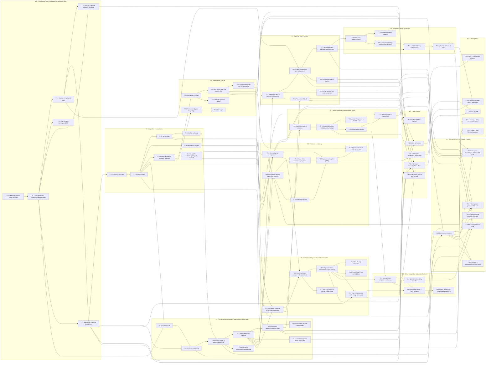

# Roadmap epics, tasks & dependency WBS

> The detailed, dependency-ordered work-breakdown structure (WBS) behind the milestone view in [80-roadmap-and-milestones.md](./80-roadmap-and-milestones.md): 13 epics → 76 tasks → 193 subtasks, with every dependency edge drawn explicitly.

**This is the INDEX file.** The legend, the id scheme, and the full task-level dependency graph live below. The **task bodies themselves** (each `T#.#`'s Goal/Implements/Exit-criteria/Depends-on/Subtasks) are split into eleven per-milestone files — see [Per-milestone task files](#per-milestone-task-files) for the table of contents.

**Source:** SPEC + docs/10,11,60,80.

> [!IMPORTANT]
> This is a **DEPENDENCY-ORDERED** work-breakdown structure. It contains **NO timelines, durations, dates, sprints, or effort estimates** — sequencing here is determined **by dependency only** (a task may begin once the tasks it `Depends on` exist). Reading order within an epic follows the dependency edges, not any calendar. The words *timeline*, *estimate*, and *duration* appear in this document **only** in this disclaimer; no time unit is ever attached to any epic, task, or subtask.

---

## Legend

**Id scheme.**

- **`E#`** — an **epic** (a coherent subsystem of work), e.g. `E4`.
- **`T#.#`** — a **task** inside an epic, e.g. `T4.3` (the third task of epic `E4`).
- **`T#.#.#`** — a **subtask** inside a task, e.g. `T4.3.1` (the first subtask of `T4.3`).

**Each task records three things.**

- **Implements:** the functional / non-functional requirement ids it realizes — **FR-\*** and **NFR-\***. Each id links to its **per-id anchor** (an `<a id="fr-a1">`-style tag placed on every bold id label) in [./10-functional-requirements.md](./10-functional-requirements.md) (FR) / [./11-non-functional-requirements.md](./11-non-functional-requirements.md) (NFR) — the link lands on the exact requirement, machine-checkable by the docs link-check CI job.
- **Exit criteria:** the conformance invariant ids that must pass for the task to be done — **INV-\*** / **INV-A\*** — each linking to its per-id anchor in [./60-conformance-and-testability.md](./60-conformance-and-testability.md). A blank exit-criteria line means the task has no *direct* gating INV; it is exercised through the tasks that depend on it.
- **Depends on:** the task ids that must exist first (the load-bearing ordering). Since the WBS is split into per-milestone files (below), these render as an **in-page** anchor link when the dependency lives in the *same* split file, or a **cross-file** link of the form `./81x-tasks-mN.md` + the task's in-file anchor when it lives in a *different* one — never a bare in-page anchor reaching across files.

**Dependency-respecting epic order.** Epics appear in an order consistent with the edges: `E1 → E2 → E3 → E4 → E5 → E6 → E7 → E8 → E9 → E10 → E11 → E12 → E13`. Within an epic, tasks are listed in their own dependency-respecting order.

> [!NOTE]
> **Maintenance — id anchors are hand-authored, but now machine-checked.** Each same-file or cross-file dependency link resolves through an explicit id-anchor tag placed on the task heading (not a GitHub auto-generated heading slug) in whichever per-milestone file owns that task, and each FR/NFR/INV link resolves through a per-id anchor tag in 10/11/60. Adding, renumbering, or removing an id — or moving a task to a different split file — means hand-editing both the anchor tag and every link that targets it, in whichever file(s) hold them. The **docs link-check CI job** (`.github/workflows/kip-docs-link-check.yml`, running `packages/kip-sdk/scripts/check-doc-links.mjs` over `packages/kip-sdk`) fails the build on any dangling relative link or missing anchor — a dropped/mistyped anchor is no longer silent, and it catches a same-file link left behind after a task moves files.

---

## Per-milestone task files

The 13 epics / 76 tasks / 193 subtasks are split into per-milestone files, one per row of the [80 milestone → epic map](./80-roadmap-and-milestones.md#milestone--epic-map), kept alongside this index (no path adjustment needed for their FR/NFR/INV links into 10/11/60):

| File | Milestone | Epic(s) |
|---|---|---|
| [81a-tasks-m0.md](./81a-tasks-m0.md) | M0 — Git substrate, fact envelope & signature-only gate | E1 |
| [81b-tasks-m1.md](./81b-tasks-m1.md) | M1 — Projection & convergence: proj, /heads, reducers | E2 |
| [81c-tasks-m2.md](./81c-tasks-m2.md) | M2 — Bitemporality & as-of | E3 |
| [81d-tasks-m3.md](./81d-tasks-m3.md) | M3 — Synchronization, merge & deterministic regeneration | E4 |
| [81e-tasks-m4.md](./81e-tasks-m4.md) | M4 — Retrieval & indexing | E5 |
| [81f-tasks-m5.md](./81f-tasks-m5.md) | M5 — Active knowledge: contextual functionalities | E6 |
| [81g-tasks-m6.md](./81g-tasks-m6.md) | M6 — Active knowledge: autoencoding (learn) | E7 |
| [81h-tasks-m7.md](./81h-tasks-m7.md) | M7 — Active knowledge: acquisition families | E8 |
| [81i-tasks-m8.md](./81i-tasks-m8.md) | M8 — Security / tenancy / DoS hardening | E9, E10 |
| [81j-tasks-m9.md](./81j-tasks-m9.md) | M9 — Conformance suite (full INV + INV-A) | E12 |
| [81k-tasks-cross-cutting.md](./81k-tasks-cross-cutting.md) | *(cross-cutting / operational — threads across milestones, see [80](./80-roadmap-and-milestones.md#milestone--epic-map))* | E11 (SDK surface), E13 (tooling & ops) |

---

## Dependency graph (task-level)

Nodes are tasks (`id` + short title); edges are the `Depends on` relation (an arrow `A --> B` means **B depends on A** — A must exist first). Subgraphs group tasks by epic. The edges below mirror the skeleton exactly.

---

## Dependency roots

The starting points — tasks with **no** `Depends on` edges, from which the entire WBS unfolds:

- [T1.1](./81a-tasks-m0.md#T1.1) — Object & ref layout + frozen manifest (the single foundation task; every other task transitively depends on it).
