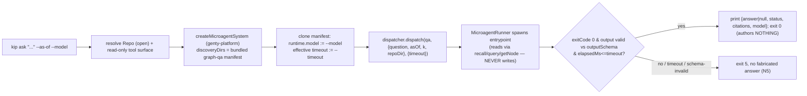

# kip CLI — a standalone command-line surface over the kip SDK

> Purpose: an **implementable design spec** for `kip`, a **standalone** command-line binary that
> drives the `@a5c-ai/kip-sdk` `Repo` surface directly and surfaces the graph-QA microagent through
> the genty layers. This doc pins the command surface, the SDK method each command calls, the stdout
> shapes (JSON + human), the exit-code contract, the genty wiring for `kip ask`, and the
> repo-dir/identity/keyring resolution — plus a machine-checkable **Acceptance criteria** section.

**Source.** The `Repo` surface is normative from [../40-sdk-api-surface.md](../40-sdk-api-surface.md)
(re-verified against `packages/kip-sdk/src/index.ts`); the genty wiring is grounded in
[../28-stack-integration.md](../28-stack-integration.md) §"Integration: genty"
(`packages/genty/{core,platform}/src/microagents/`). The CLI adds **no new substrate semantics** — it
is a thin, read-through/author-through client of the exact seams those docs define. Every write still
enters kip only as a signed, append-only fact (INV-A1, N5); the CLI never becomes a second author path.

> **Scope boundary (HARD, from the run owner).** The `kip` binary is **standalone**. It depends on
> `@a5c-ai/kip-sdk` and the genty layers (`@a5c-ai/genty-platform`, `@a5c-ai/genty-core`) **only**. It
> **MUST NOT** import, require, spawn, or route through `@a5c-ai/babysitter-sdk` — the babysitter run
> orchestrator and the kip memory CLI are separate responsibilities and stay separately buildable
> (§28 "Where kip sits in the stack": kip is a library/substrate, not a babysitter runtime). A build
> that pulls `@a5c-ai/babysitter-sdk` into the `kip` bin's dependency closure is a conformance failure
> (AC-1).

## Table of contents

- [1. Packaging & the `bin` entry](#1-packaging--the-bin-entry)
- [2. Global options, resolution & identity](#2-global-options-resolution--identity)
- [3. Output & exit-code contract](#3-output--exit-code-contract)
- [4. Command surface](#4-command-surface)
  - [4.1 `kip init` / `kip open`](#41-kip-init--kip-open)
  - [4.2 `kip assert`](#42-kip-assert)
  - [4.3 `kip retract`](#43-kip-retract)
  - [4.4 `kip get`](#44-kip-get)
  - [4.5 `kip query`](#45-kip-query)
  - [4.6 `kip recall`](#46-kip-recall)
  - [4.7 `kip asof`](#47-kip-asof)
  - [4.8 `kip fsck`](#48-kip-fsck)
  - [4.9 `kip rollup`](#49-kip-rollup)
  - [4.10 `kip sync`](#410-kip-sync)
  - [4.11 `kip ask`](#411-kip-ask)
- [5. Wiring genty for `kip ask`](#5-wiring-genty-for-kip-ask)
- [6. Error behavior](#6-error-behavior)
- [7. Acceptance criteria](#7-acceptance-criteria)
- [8. Cross-links](#8-cross-links)

---

## 1. Packaging & the `bin` entry

The CLI ships as its **own** entry within `@a5c-ai/kip-sdk` (no separate npm package needed; one
binary, one dependency closure):

- **`bin` map** (added to `packages/kip-sdk/package.json`): `{ "kip": "dist/cli/kip.js" }`. The entry
  file starts with `#!/usr/bin/env node` and calls `main(process.argv.slice(2))`.
- **Source layout:** `packages/kip-sdk/src/cli/kip.ts` (arg parse + dispatch), `src/cli/commands/*.ts`
  (one module per subcommand), `src/cli/resolve.ts` (repo-dir/identity/keyring resolution),
  `src/cli/render.ts` (JSON + human renderers), `src/cli/ask.ts` (genty dispatch seam). Colocated
  `*.test.ts` per the package's vitest convention.
- **Runtime dependency closure (normative):** `@a5c-ai/kip-sdk` (self), `@a5c-ai/genty-platform`,
  `@a5c-ai/genty-core`. The `ask` path imports `createMicroagentSystem` from `@a5c-ai/genty-platform`
  (`packages/genty/platform/src/microagents/index.ts`) and the `MicroagentManifest`/`MicroagentResult`
  contract types from `@a5c-ai/genty-core`. **No `@a5c-ai/babysitter-sdk` import anywhere on this path.**
- **No hidden orchestrator.** The CLI does **not** stand up a babysitter `OrchestrationProvider` /
  `JournalProvider` registry (§28). It calls kip `Repo` methods in-process; for `ask` it uses the
  genty `MicroagentDispatcher` directly (§5). This is deliberate: the CLI is a memory client, not a
  run orchestrator.

Argument parsing is done with a zero-dependency internal parser (no `commander`/`yargs` runtime dep is
required; keep the closure minimal). The grammar is `kip [GLOBAL_OPTS] <command> [ARGS] [CMD_OPTS]`.

---

## 2. Global options, resolution & identity

Every command resolves a `Repo` by constructing `OpenOptions`
([../40-sdk-api-surface.md](../40-sdk-api-surface.md) `OpenOptions`) and calling the package's
exported `open(options)` (`packages/kip-sdk/src/index.ts` `export async function open`). Resolution is
**pure precedence** — flag → environment → default — and every failure is surfaced **before** any SDK
call (exit 3, §3), never as a silent default (N5, "fallbacks are evil").

| Global option | Env fallback | Default | Feeds |
|---|---|---|---|
| `--dir <path>` | `KIP_DIR` | `./.kip` | `OpenOptions.dir` |
| `--replica <id>` | `KIP_REPLICA_ID` | — (**required**; no invented default) | `OpenOptions.replicaId` |
| `--keyring <path>` | `KIP_KEYRING` | `<dir>/keyring.json` if present | `OpenOptions.keyring` (loaded key material) |
| `--tenant <t>` | `KIP_TENANT` | — | `Repo.withScope({ tenant, namespace? })` (§8) |
| `--namespace <ns>` | `KIP_NAMESPACE` | — (absent = all namespaces the key may read) | `ScopeRef.namespace` |
| `--json` | — | off (human render) | output mode (§3) |
| `--as-of <t>` | — | now-frontier | per-read `AsOf.validTime` (read commands only) |
| `-h/--help`, `-V/--version` | — | — | usage / version, exit 0 |

**Repo-dir resolution.** `--dir`/`KIP_DIR`/`./.kip` in that order. For read/write commands the dir
**must already be an initialized kip repo** (a git dir with a valid `/manifest.json`); if it is empty
or missing, the command exits 3 with `repo not initialized at <dir>; run 'kip init' first` — it does
**not** auto-create (only `kip init` creates, and only with `--create`).

**Identity resolution.** `replicaId` is mandatory for any command that opens the repo; if neither
`--replica` nor `KIP_REPLICA_ID` is set, exit 3 with `replicaId required (--replica or KIP_REPLICA_ID)`.
The CLI never fabricates a replica id (a fabricated stable author id would corrupt the per-`(replicaId,key)`
seq chain, §4b.1).

**Keyring resolution.** The keyring file is JSON key material that the SDK chains to the tenant root
(`OpenOptions.keyring`, §8.1). Precedence: `--keyring` → `KIP_KEYRING` → `<dir>/keyring.json`. For
**write** commands (`assert`, `retract`) the keyring is **required** (the author signs the fact); a
missing/unreadable keyring exits 3 with `keyring required to author facts`. For **read-only** commands
(`get`, `query`, `recall`, `asof`, `fsck`, `ask`) a keyring is **optional** — reads verify existing
signatures, they do not sign — and the command proceeds with a read-only repo handle when none is
supplied. `sync` requires a keyring only if `--push` is set.

**Scope.** When `--tenant` is given, the resolved `Repo` is lensed via `repo.withScope({ tenant,
namespace })` before the command runs; authoring an EID outside the scope surfaces `ERR_SCOPE_DENIED`
(exit 1). Absent `--tenant`, the command runs against the repo's default scope.

---

## 3. Output & exit-code contract

The CLI honors kip's **two-channel** discipline
([../40-sdk-api-surface.md](../40-sdk-api-surface.md) §"Errors"): **domain outcomes are DATA** (printed
to stdout, exit 0 unless an opt-in `--fail-on-*` flag is set); **caller-input rejections THROW a typed
`KipError`** (exit 1). It never blurs the two.

**Output modes.** `--json` prints one canonical JSON value to stdout (machine mode; the *only* thing on
stdout is the JSON — logs/warnings go to stderr). Without `--json`, a human-readable rendering is
printed (tables/labels). The **JSON shape is the contract** that AC tests assert against; the human
render is advisory and unversioned.

**Global exit codes.**

| Code | Meaning | Examples |
|---|---|---|
| `0` | Command evaluated; result (incl. `null`, empty, `choice`, `pin-incomplete`, `conflict`, `unanswerable`) on stdout | `kip get <unknown-eid>` → `null` |
| `1` | A typed `KipError` was thrown (caller-input rejection) | `ERR_MALFORMED_INPUT`, `ERR_SCOPE_DENIED`, `ERR_SIGNATURE_INVALID`, `ERR_UNAUTHORIZED_EXCISION` |
| `2` | CLI usage error (unknown command/flag, missing required positional, bad `--json` value) | `kip frobnicate` |
| `3` | Environment/resolution error, surfaced **before** any SDK call | repo not initialized; `replicaId` missing; keyring required but unreadable |
| `4` | Transport/sync failure (wraps the underlying transport error) | `kip sync` cannot reach the remote |
| `5` | Microagent **dispatch** failure on `kip ask` (agent errored, timed out, or returned schema-invalid output — N5: **no fabricated answer**) | `ask` subprocess non-zero exit |

**`KipError` rendering.** On exit 1 with `--json`, stderr carries
`{ "error": { "code": <KipErrorCode>, "message": <string>, "context"?: <object> } }`; without `--json`,
`kip: <code>: <message>` on stderr. `KipErrorCode` values are the enum from
[../40-sdk-api-surface.md](../40-sdk-api-surface.md) (`ERR_MALFORMED_INPUT`, `ERR_SIGNATURE_INVALID`,
`ERR_SCOPE_DENIED`, `ERR_UNAUTHORIZED_EXCISION`, `ERR_COMPILE_CYCLIC_DEPS`, `ERR_ILL_TYPED_SEGMENT`,
`ERR_UNREGISTERED_MANIFEST`, …).

**Opt-in data→exit mappings.** Because a `conflicted`/`unknown`/`choice` outcome is *data*, scripts
that want a non-zero signal pass an explicit flag: `--fail-on-conflict` (exit 6 if any surfaced cell is
`conflicted`), `--fail-on-unknown` (exit 6 if a read resolves to `null`/Unknown). Default is off; the
data is always still printed to stdout first.

---

## 4. Command surface

Each subcommand below lists: **args/flags**, the **SDK method** it calls, the **stdout JSON shape**,
the **human render**, and **exit codes** beyond the globals in §3.

### 4.1 `kip init` / `kip open`

Two related lifecycle commands over the SDK `open(options)`.

- **`kip init`** — create a fresh memory repo (genesis).
  - **Args/flags:** `--create` (required to actually create; guards accidental init over a non-empty
    dir), and genesis params surfaced as flags with genesis-final semantics (§3.1 immutability):
    `--hash-algo <sha1|sha256>` (default `sha256`), `--shard-depth <n>`, `--clock-epoch <n>`,
    `--epsilon-causal-ms <n>`, `--root-key <fpr>` (repeatable → `genesis.rootKeys[]`),
    `--quarantine-ttl-ms`, `--quarantine-key-cap-bytes`, `--quarantine-pool-bytes`,
    `--key-chain-durable-cap-bytes`, `--heads-committed`. `--genesis-file <path>` accepts the whole
    `genesis` block as JSON (mutually exclusive with the individual flags).
  - **SDK method:** `open({ dir, replicaId, keyring, createIfMissing: true, genesis })`.
  - **stdout JSON:** `{ "dir": <path>, "created": true, "manifestGenesisCid": <CID>, "branch": <branch> }`.
  - **Human:** `initialized kip repo at <dir> (genesis <CID>, branch <branch>)`.
  - **Exit:** `0` on create; `3` if the dir is non-empty and not a kip repo, or `--create` omitted; `1`
    on `ERR_MALFORMED_INPUT` (bad genesis) / `ERR_HASH_ALGO_MISMATCH` / `ERR_MANIFEST_FORK`.
- **`kip open`** — open an existing repo and print status (no write).
  - **Args/flags:** none beyond globals.
  - **SDK method:** `open({ dir, replicaId, keyring? })` then `repo.branch()`.
  - **stdout JSON:** `{ "dir": <path>, "created": false, "branch": <branch>, "manifestGenesisCid": <CID> }`.
  - **Exit:** `0` on success; `1` on `ERR_MANIFEST_FORK`/`ERR_HASH_ALGO_MISMATCH`; `3` if not
    initialized.

### 4.2 `kip assert`

Author a signed `assert` fact (node/edge/prop existence). This is the substrate write path.

- **Args/flags (two forms):**
  - **Node form:** `kip assert node --eid <EID> --kind <NodeKind> [--prop k=v ...] [--valid-from <t>]
    [--valid-to <t>]` → SDK **`putNode(NodePut)`** (sugar that compiles to `assert` facts).
  - **Edge form:** `kip assert edge --kind <EdgeKind> --from <EID> --to <EID> [--eid <EID>]
    [--prop k=v ...] --valid-from <t> [--valid-to <t>]` → SDK **`putEdge(EdgePut)`**.
  - **Raw-fact form:** `kip assert fact --file <fact.json>` or `--stdin` → SDK **`assertFact(AssertInput)`**
    (caller supplies only intent fields; kip stamps `id`/`hlc`/`seq`/`signature`).
  - `--prop k=v` values are parsed as JSON scalars (`PropValue = string|number|boolean|null|BlobRef`);
    a `k=@<cid>` form denotes a `BlobRef`.
- **SDK method:** `putNode` / `putEdge` / `assertFact` per form.
- **stdout JSON:** the echo shape depends on the SDK method the form calls:
  - **Raw-fact form** (`assertFact` — exactly ONE fact): the full stamped envelope
    `{ "id": <FactId>, "hlc": <HlcStamp>, "seq": <n>, "status": "pending"|"durable" }`.
  - **Node/edge forms** (`putNode`/`putEdge`): these are sugar that compile to **multiple** facts
    (node/edge existence + one fact per declared prop) and return only the entity `EID`
    ([../40-sdk-api-surface.md](../40-sdk-api-surface.md) — `putNode(node): Promise<EID>`), so there is
    **no single stamped fact identity** to echo. The echo is `{ "eid": <EID>, "status": "pending" }` —
    the CLI never fabricates an `id`/`hlc`/`seq` it cannot obtain (N5, "fallbacks are evil"). A
    `kip commit` / txn boundary is what flips `pending`→`durable`.
- **Human:** `asserted <eid|factId> (seq <n>, <status>)`.
- **Exit:** `0` on accept; `1` on `ERR_MALFORMED_INPUT` / `ERR_SCOPE_DENIED` / `ERR_SIGNATURE_INVALID`.

### 4.3 `kip retract`

Author a signed `retract` fact (a bounded `validTo` on an existing cell). Accretion-only — this does
not delete bytes (`tombstone`/`excise` are separate, §4.5 of the SDK doc, and out of this CLI's core
surface).

- **Args/flags:** `kip retract fact --file <retract.json>` / `--stdin`, or the targeted form
  `kip retract --eid <EID> [--prop <PropKey>] --valid-to <t>` (builds a `RetractInput` over the named
  cell).
- **SDK method:** **`retractFact(RetractInput)`**.
- **stdout JSON:** `{ "id": <FactId>, "hlc": <HlcStamp>, "seq": <n>, "status": "pending"|"durable" }`.
- **Human:** `retracted <eid[.prop]> (seq <n>, <status>)`.
- **Exit:** `0` on accept; `1` on `ERR_MALFORMED_INPUT` / `ERR_SCOPE_DENIED` / `ERR_SIGNATURE_INVALID`.

### 4.4 `kip get`

Read a single node or edge as-of a time.

- **Args/flags:** `kip get <EID>` (default node), `--edge` to read an edge, `--as-of <t>` (global).
- **SDK method:** **`getNode(eid, asOf?)`** (or **`getEdge`** with `--edge`).
- **stdout JSON:** the `NodeView` (`{ eid, kind, props: Record<PropKey, PropCell>, provenance }`) with
  each `PropCell.segments[]` carrying resolved values, **or `null`** for an unknown/never-asserted EID.
  With `--edge`, the `EdgeView` (`{ eid, kind, from, to, props, validFrom, validTo, provenance }`).
- **Human:** a key/value table of resolved prop values with a provenance footer; `null` renders as
  `(no such node)`.
- **Exit:** `0` for both a found view **and** `null` (unknown EID is *data*, not an error); `1` on
  `ERR_MALFORMED_INPUT` (malformed selector).

### 4.5 `kip query`

Typed, bounded, as-of graph traversal.

- **Args/flags (all map to `TraversalSpec`; `depth`/`maxFanout` are MANDATORY, no unbounded default):**
  `--seed <EID>` (repeatable → `EID[]`), `--direction <out|in|both>` (required),
  `--edge-kind <k>` (repeatable → `edgeKinds[]`), `--depth <n>` (**required**),
  `--max-fanout <n>` (**required**), `--kind <NodeKind>` (repeatable → target-kind filter),
  `--as-of <t>`.
- **SDK method:** **`query(spec: TraversalSpec)`** (an `AsyncIterable<NodeView | EdgeView>`, drained by
  the CLI).
- **stdout JSON:** a JSON array of the yielded `NodeView | EdgeView` objects, in traversal order. When
  `--ndjson` is passed, one view per line (streaming).
- **Human:** one line per visited node/edge (`<kind> <eid>`), indented by hop.
- **Exit:** `0` on success (empty array is valid data); `2` if `--depth` or `--max-fanout` is missing
  (usage error — the bound is mandatory); `1` on `ERR_MALFORMED_INPUT`.

### 4.6 `kip recall`

Hybrid vector+graph+RRF retrieval.

- **Args/flags:** `kip recall "<query text>"` (positional → `RecallQuery.query`), `--k <n>` (top-k),
  `--embedding-file <path>` (caller-supplied `number[]` embedding → `RecallQuery.embedding`),
  `--as-of <t>`.
- **SDK method:** **`recall(q: RecallQuery)`** → `RecallResult[]`.
- **stdout JSON:** the `RecallResult[]` array —
  `[{ eid, view, score, ranks: { vector?, graph?, salience? }, conflicted, provenance }]`, RRF-fused
  order (§5.1).
- **Human:** a ranked list `#<i> <score> <eid> <kind>` with a `⚠ conflicted` marker where
  `conflicted` is true.
- **Exit:** `0` (empty results is valid data); `1` on `ERR_MALFORMED_INPUT`. With `--fail-on-conflict`,
  exit `6` if any result is `conflicted` (data still printed first).

### 4.7 `kip asof`

Curry a fixed-`AsOf` read view and run one sub-read against it (bitemporal lens).

- **Args/flags:** `--valid-time <t>` and/or `--tx-time <hlc>` and/or `--believer <replicaId>` (build the
  `AsOf`), then a required sub-read selector: `get <EID> [--edge]`, `query <...same flags as 4.5...>`,
  or `recall "<q>" [--k n]`.
- **SDK method:** **`asOf(asOf): Promise<ReadView>`**, then `view.getNode`/`view.getEdge`/`view.query`/
  `view.recall` (the `ReadView` sub-surface; note its read methods take `Omit<…,"asOf">` — the AsOf is
  already fixed).
- **stdout JSON:** identical shape to the corresponding live-read command (a `NodeView|null`,
  `(NodeView|EdgeView)[]`, or `RecallResult[]`), but evaluated against the fixed frontier.
- **Human:** same as the corresponding live command, prefixed with the resolved `AsOf`.
- **Exit:** `0` on success; `2` if no sub-read selector is given; `1` on `ERR_MALFORMED_INPUT`.

### 4.8 `kip fsck`

Verify the repo: `heads == proj(facts)`, all **fact** signatures, and the author-HLC authority chain
(commit signatures are NOT checked — transport, M2-2).

- **Args/flags:** none beyond globals; `--quiet` suppresses the human report body.
- **SDK method:** **`fsck(): Promise<FsckReport>`**.
- **stdout JSON:** the `FsckReport` verbatim — `{ ok, headsMatch, mergeDriverInstalled,
  manifestGenesisCidMatch, badSignatures[], authorityViolations[], excisionResidue[], missingDurable[],
  missingNonDurable[], promisorMissingDurable[] }`.
- **Human:** a checklist; a red line per non-empty failure array.
- **Exit:** `0` iff `report.ok === true`; **`1` iff `report.ok === false`** (this is the one read
  command where a *report field* maps to a non-zero exit, because `fsck` is an integrity gate whose
  whole purpose is a pass/fail verdict — `report.ok` is still printed as data on stdout either way).
  `fsck` itself never throws (`FsckReport` failures are report fields).

### 4.9 `kip rollup`

Materialize a read-latency snapshot up through an author-HLC (does **not** free bytes, §3.5).

- **Args/flags:** `--through-hlc <hlc>` (**required** → `RollupOptions.throughHlc`),
  `--tenant`/`--namespace` (optional → `RollupOptions.scope`).
- **SDK method:** **`rollup(opts: RollupOptions): Promise<CID>`**.
- **stdout JSON:** `{ "rollup": <CID>, "throughHlc": <HlcStamp>, "scope"?: <ScopeRef> }`.
- **Human:** `rolled up through <hlc> → <CID>`.
- **Exit:** `0` on success; `1` on `ERR_MALFORMED_INPUT` (bad `throughHlc`).

### 4.10 `kip sync`

Fetch/push facts against a git remote and set-union merge; conflicts are returned as **data** (never
auto-picked).

- **Args/flags:** `kip sync <remote>` (a git remote name or URL → `RemoteRef`), `--fetch`/`--push`
  (default both), `--remote-branch <ref>` (repeatable → `SyncOptions.remoteBranches`),
  `--retention <default|permissive>`.
- **SDK method:** **`sync(remote: RemoteRef, opts?: SyncOptions): Promise<SyncReport>`**.
- **stdout JSON:** the `SyncReport` — `{ received, sent, merged, conflicts: Conflict[], tip: <CID> }`.
- **Human:** `synced <remote>: +<received>/-<sent>, merged <merged>, <conflicts.length> conflict(s),
  tip <CID>`.
- **Exit:** `0` on a completed sync **even when `conflicts` is non-empty** (conflicts are typed data,
  surfaced for the caller, never auto-resolved); **`4`** on a transport failure (wrapped) or
  `ERR_NO_PROMISOR_PEER`. With `--fail-on-conflict`, exit `6` if `conflicts.length > 0` (report still
  printed).

### 4.11 `kip ask`

Answer a **natural-language question** over the graph. `ask` runs the **graph-QA microagent** — a
read-only genty microagent that this CLI surfaces — turning an NL question into an NL answer grounded in
kip reads. **Read-only:** `ask` authors **no facts** (INV-A1: a microagent is a client, never the
substrate; and QA is a pure read). It does **not** go through `runAcquisition`/`runContextualQuery`
(which author `assert`/`derived_from` facts); it dispatches the QA microagent directly via genty and
returns its output. See §5 for the wiring.

- **Args/flags:** `kip ask "<question>"` (positional, required), `--as-of <t>` (the QA agent's reads
  are pinned to this frontier), `--model <id>` (overrides the QA manifest's `runtime.model`, §5),
  `--timeout <ms>` (caps the dispatch; maps to the effective `MicroagentInvocation.timeout`),
  `--k <n>` (max supporting facts the agent may cite), `--manifest <name@version>` (advanced: select a
  non-default QA manifest by registered `(name,version)`; unknown → `ERR_UNREGISTERED_MANIFEST`).
- **SDK/genty method:** `createMicroagentSystem({...}).dispatcher.dispatch(<qa-manifest-name>, input,
  { timeout })` (§5), where `input` is `{ question, asOf?, k?, repoDir }` validated against the QA
  manifest `inputSchema`. The agent's tools are **read-only kip seams** (`recall`, `query`, `getNode`,
  `getEdge`, `asOf`) bound over the same resolved `Repo`.
- **stdout JSON:**
  `{ "answer": <string|null>, "status": "answered"|"unanswerable", "citations": [{ "eid": <EID>,
  "factId"?: <FactId> }], "model": <id>, "asOf"?: <AsOf> }`. `status: "unanswerable"` with
  `answer: null` is the **data** outcome when the graph supports no answer (N5 — the agent must not
  fabricate; empty is empty).
- **Human:** the answer prose, followed by a `Sources:` list of cited EIDs.
- **Exit:** `0` for both `answered` and `unanswerable` (a truthful "I can't answer that from the graph"
  is a valid answer, not a failure); **`5`** if the microagent **dispatch itself fails** — non-zero
  `exitCode`, timeout (`elapsedMs > timeout`), or output that fails `outputSchema` validation (N5: no
  fabricated answer is printed, nothing is authored); `1` on `ERR_UNREGISTERED_MANIFEST` (bad
  `--manifest`) or `ERR_MALFORMED_INPUT` (empty question).

---

## 5. Wiring genty for `kip ask`

`ask` is the CLI's one genty-backed command. The wiring reuses the **exact** dispatch seam §28
grounds, with **no babysitter-sdk on the path** and **no orchestration registry** — this is a single,
synchronous, read-only microagent call, not a run.

**5.1 The dispatch seam.** The CLI builds a genty microagent system with
`createMicroagentSystem(options)` from `@a5c-ai/genty-platform`
(`packages/genty/platform/src/microagents/index.ts`) and calls `system.dispatcher.dispatch(name, input,
{ timeout })` (`MicroagentDispatcher.dispatch`, `platform/src/microagents/dispatch.ts`). The QA
manifest is provided to the system via `MicroagentSystemOptions.discoveryDirs` (pointing at the kip
CLI's bundled `microagents/graph-qa/` dir containing its `microagent.json`), so the standalone binary
carries its own QA manifest rather than depending on a babysitter-registered one. `dispatch` builds a
`MicroagentInvocation` (`{ microagentName, input, timeout }`) and the `MicroagentRunner` spawns the
manifest's `runtime.entrypoint` as a subprocess, validates `input` against `inputSchema`, parses
stdout, validates against `outputSchema`, and returns a `MicroagentResult` (`{ output, exitCode,
durationMs, … }`). The CLI reads **only** `output`/`exitCode`/effective `timeout` from the result
(§28: the orchestrator reads only those fields), maps a clean result to the §4.11 stdout shape, and
maps any dispatch failure to exit 5 (N5 — never fabricates).

**5.2 Read-only tool binding (INV-A1).** The QA microagent must not write the graph. The CLI hands the
agent a **read-only kip tool surface** — thin wrappers over the resolved `Repo`'s `recall`, `query`,
`getNode`, `getEdge`, and `asOf` (all pure reads) — via the manifest's declared `runtime.tools`. No
`assertFact`/`putNode`/`runAcquisition` tool is exposed to it. The agent returns a proposed NL answer +
citations; the CLI prints them and authors nothing. This is the load-bearing difference from
`runAcquisition` (which *does* author the agent's proposals as quarantined facts): `ask` is
deliberately the non-authoring QA path.

**5.3 Model selection via `runtime.model`.** The QA manifest declares a default model in
`MicroagentManifest.runtime.model` (`packages/kip-sdk/src/index.ts` `MicroagentManifest.runtime.model`;
genty-core contract). `kip ask --model <id>` overrides it for the single invocation: the CLI clones the
resolved manifest with `runtime.model` replaced by `<id>` before dispatch (the effective model is
echoed in the stdout `"model"` field). Absent `--model`, the manifest's `runtime.model` is dispatched
verbatim; **the CLI never silently substitutes a model (N5)**. Likewise `--timeout` sets the **effective**
`MicroagentInvocation.timeout` (the manifest `runtime.timeout` is the default when the flag is absent —
the "Timeout rule" of §28/docs-31).

**The `"model"` field names the model that ACTUALLY produced the prose — and that is what "never
silently substitutes" means here.** The two words carry the whole rule: *silently*, and *the CLI*.

- **The CLI substitutes nothing.** It clones the manifest with the effective `runtime.model` and
  dispatches that. It has no model table and consults none.
- **A DISPATCHER may resolve** the effective model to a concrete id — the bundled manifest ships the
  sentinel `"kip-graph-qa-default"` ([ADR-B8](../70-decision-records-adr.md), Decision), which is *not
  a model id* and cannot be passed to a harness `--model`. When a dispatcher resolves one, it reports
  what it resolved (`MicroagentResult.output.model` — this `outputSchema` is kip's own), and the CLI
  echoes **that**. So the resolution appears in the very field that reports provenance: it is
  surfaced, never silent.
- **A dispatcher that resolves nothing reports nothing**, and the effective `runtime.model` is echoed
  **verbatim** — the literal §5.3 behavior above, and what every scripted dispatcher and any host
  runtime owning `runtime.model` itself produces.

Why this matters rather than being cosmetic: §5 makes the answer an **accelerator-class,
model-relative artifact** whose wording MAY change after a model upgrade, so the echoed `"model"` is
the ONLY provenance a caller has for *which model spoke*. Echoing a sentinel there — a value that is
not a model — while a different model wrote the prose is a false report, and N5 is precisely the rule
against reporting something other than what happened. (Round-2 review finding #5; the earlier reading
of §5.3 pinned that misreport in two frozen suites.)

**5.4 As-of grounding.** `--as-of` is threaded into the QA `input.asOf`; the read-only tools the agent
calls are curried at that `AsOf` (via `repo.asOf(asOf)`), so an `ask` answer is reproducible against a
recorded frontier (R5). The resolved `AsOf` is echoed in stdout.

---

## 6. Error behavior

- **Resolution errors are pre-flight (exit 3).** Repo-not-initialized, missing `replicaId`, and
  keyring-required-but-unreadable are all detected in `src/cli/resolve.ts` **before** `open()` is
  called, with an actionable message on stderr. They are never surfaced as a silent default.
- **`KipError` is exit 1.** Any thrown `KipError` from the SDK is caught at the top level and rendered
  per §3 (`{ error: { code, message, context? } }` in `--json`), preserving the SDK `KipErrorCode`
  verbatim. The CLI adds no error codes of its own; it maps them to exit 1.
- **Domain outcomes are exit 0 by default.** `null` (`get`), empty arrays (`query`/`recall`), a
  `choice`/`conflict`, `pin-incomplete`, and `ask`'s `unanswerable` all print as data and exit 0. The
  opt-in `--fail-on-conflict`/`--fail-on-unknown` flags (exit 6) exist purely so scripts can request a
  non-zero signal without the CLI reinterpreting data as failure.
- **`fsck` is the deliberate exception:** `report.ok === false` → exit 1 (integrity verdict), with the
  full `FsckReport` still on stdout.
- **`sync` transport failure is exit 4**, distinct from a conflict-bearing-but-successful sync (exit 0).
- **`ask` dispatch failure is exit 5**, distinct from an honest `unanswerable` (exit 0); the CLI never
  prints a fabricated answer on the failure path (N5).
- **Usage errors are exit 2**, emitted before any resolution (unknown command/flag, missing required
  positional, missing mandatory `--depth`/`--max-fanout` on `query`).
- **No `--force`, no auto-pick.** The CLI never resolves a `Conflict`, never auto-selects among
  `Segment.alternatives`, and never dereferences a `BlobRef` into a printed value unless explicitly
  asked — consistent with N5 across the surface.

---

## 7. Acceptance criteria

Each item is phrased so a test author can turn it directly into a vitest assertion against the built
`kip` binary (spawned as a subprocess) or the CLI `main(argv)` entry (invoked in-process with a stub
`Repo`/dispatcher). "Exits N" = process exit code N; "prints X" = the JSON value on stdout under
`--json`.

1. **Dependency isolation:** the built `kip` bin's runtime dependency closure contains
   `@a5c-ai/kip-sdk`, `@a5c-ai/genty-platform`, and `@a5c-ai/genty-core`, and **does not** contain
   `@a5c-ai/babysitter-sdk` (assert via a static import-graph/`require` scan of `dist/cli/**` — no
   module resolves to `@a5c-ai/babysitter-sdk`).
2. **`kip --version` / `kip -V`** prints the `@a5c-ai/kip-sdk` package version and exits 0; an unknown
   command (`kip frobnicate`) exits 2 with a usage message on stderr.
3. **`kip init --create --dir <empty> --replica r1 --root-key <fpr> ...`** calls `open()` with
   `createIfMissing: true` and a `genesis` block assembled from the flags, prints
   `{ created: true, manifestGenesisCid, branch }`, and exits 0; a second `kip init --create` over the
   now-non-empty dir exits 3 without calling `open()`.
4. **`kip open --dir <initialized> --replica r1`** prints `{ created: false, branch, manifestGenesisCid }`
   and exits 0; **`kip open --dir <empty>`** exits 3 (`repo not initialized`) before any SDK call.
5. **Missing identity:** any command that opens the repo without `--replica` and without
   `KIP_REPLICA_ID` exits 3 with a `replicaId required` message and never calls `open()`.
6. **Keyring policy:** `kip assert node ...` with no resolvable keyring exits 3 (`keyring required to
   author facts`); `kip get <eid>` with no keyring proceeds and exits 0 (reads do not require a keyring).
7. **`kip assert node --eid e1 --kind Person --prop name=\"Ada\"`** calls `putNode` with the parsed
   `NodePut` and prints the truthful sugar echo `{ eid: "e1", status: "pending" }` — `putNode` returns
   only the `EID` (docs/40), so **no** fabricated `id`/`hlc`/`seq` is emitted (N5); exits 0.
8. **`kip assert edge --kind knows --from e1 --to e2 --valid-from <t>`** calls `putEdge` with the parsed
   `EdgePut` and prints `{ eid, status: "pending" }` (same EID-only sugar echo as AC-7); exits 0.
9. **`kip assert fact --file bad.json`** where the input fails well-formedness throws
   `ERR_MALFORMED_INPUT`; the CLI exits 1 and prints `{ error: { code: "ERR_MALFORMED_INPUT", ... } }`
   to stderr under `--json`.
10. **Scope denial:** `kip --tenant t1 assert node --eid <out-of-scope> ...` surfaces `ERR_SCOPE_DENIED`
    from the scoped repo and exits 1.
11. **`kip retract --eid e1 --prop name --valid-to <t>`** calls `retractFact` with the built
    `RetractInput` and prints `{ id, hlc, seq, status }`; exits 0.
12. **`kip get e1 --json`** prints the `NodeView` for `e1` with `props` as a
    `Record<PropKey, PropCell>` whose `segments[]` carry resolved prop values, and exits 0.
13. **`kip get <unknown-eid> --json`** prints `null` and exits 0 (unknown EID is data, not an error).
14. **`kip get e1 --edge --json`** on an edge EID prints the `EdgeView`
    (`{ eid, kind, from, to, props, validFrom, validTo, provenance }`) and exits 0.
15. **`kip query --seed e1 --direction out --depth 2 --max-fanout 8 --json`** calls `query` with a
    `TraversalSpec` carrying `depth: 2, maxFanout: 8`, drains the async iterable, and prints a JSON
    array of `NodeView|EdgeView` in traversal order; exits 0.
16. **Mandatory bound:** `kip query --seed e1 --direction out` (no `--depth`/`--max-fanout`) exits 2
    (usage error) and never calls `query` — the bound is mandatory, with no unbounded default.
17. **`kip recall \"who knows Ada\" --k 5 --json`** calls `recall` with `RecallQuery.query` and `k: 5`
    and prints a `RecallResult[]` (each `{ eid, view, score, ranks, conflicted, provenance }`) in
    fused order; an empty result prints `[]` and exits 0.
18. **`--fail-on-conflict`:** when a `recall`/`sync` result contains a `conflicted`/`Conflict` entry,
    the data is still printed on stdout and, only with `--fail-on-conflict`, the process exits 6;
    without the flag it exits 0.
19. **`kip asof --valid-time <t> get e1 --json`** calls `asOf(asOf)` then `view.getNode("e1")` and
    prints the `NodeView` (or `null`) evaluated at the fixed frontier; exits 0. `kip asof --valid-time <t>`
    with no sub-read selector exits 2.
20. **`kip fsck --json`** prints the full `FsckReport`; when `report.ok === true` it exits 0, and when
    `report.ok === false` it exits 1 with the report (incl. non-empty `badSignatures`/
    `authorityViolations`) still on stdout.
21. **`kip rollup --through-hlc <hlc> --json`** calls `rollup` with `RollupOptions.throughHlc` and
    prints `{ rollup: <CID>, throughHlc }`; exits 0. Omitting `--through-hlc` exits 2.
22. **`kip sync <remote> --json`** calls `sync` and prints the `SyncReport`
    (`{ received, sent, merged, conflicts, tip }`); a sync that completes **with** non-empty
    `conflicts` still exits 0 (conflicts are surfaced data, never auto-picked).
23. **Sync transport failure:** when `sync`'s underlying transport throws, the CLI exits 4 (not 1) with
    the wrapped cause on stderr.
24. **`kip ask \"...\" --json`** dispatches the graph-QA microagent via
    `createMicroagentSystem(...).dispatcher.dispatch` (a genty-platform call — assert no
    `@a5c-ai/babysitter-sdk` symbol is touched) and prints
    `{ answer, status, citations, model, asOf? }`; on a clean answer `status === "answered"` and it
    exits 0.
25. **`ask` authors nothing:** after a successful `kip ask`, the repo's fact count / head tip is
    unchanged versus before the call (the QA path is read-only; INV-A1) — assert via a `fsck`/head-tip
    or `provenanceOf` comparison, or a spy showing no `assertFact`/`putNode`/`runAcquisition` call.
26. **`ask` unanswerable is data:** when the QA agent returns an empty/`null` answer, the CLI prints
    `{ answer: null, status: "unanswerable", ... }` and exits 0 (no fabricated answer, N5).
27. **`ask` dispatch failure is exit 5:** when the QA `MicroagentResult` has a non-zero `exitCode`, an
    `elapsedMs`/duration exceeding the effective `timeout`, or output failing `outputSchema`
    validation, the CLI exits 5 and prints **no** `answer` field (nothing fabricated, nothing authored).
28. **Model override:** `kip ask \"...\" --model <id>` dispatches with the QA manifest cloned so
    `runtime.model === <id>`, and the stdout `"model"` field equals `<id>`; absent `--model`, `"model"`
    equals the manifest's default `runtime.model` (no silent substitution).
29. **As-of grounding:** `kip ask \"...\" --as-of <t>` threads `<t>` into the QA `input.asOf` and the
    resolved `AsOf` is echoed in stdout; the agent's kip tool reads are curried at that frontier.
30. **Unknown manifest:** `kip ask \"...\" --manifest nope@1.0.0` surfaces `ERR_UNREGISTERED_MANIFEST`
    and exits 1 without spawning any subprocess.
31. **Human vs JSON parity:** for every read command, the `--json` stdout is exactly one JSON value
    (parseable; nothing else on stdout), while the non-`--json` render writes human text and any
    diagnostics go to stderr — stdout under `--json` is never polluted by logs.
32. **No auto-pick:** a `runContextualQuery`-style multi-match is never triggered by `ask` (ask is the
    non-authoring QA path); and no command ever resolves a `Conflict` or selects among
    `Segment.alternatives` on the caller's behalf.

---

## 8. Cross-links

- [../40-sdk-api-surface.md](../40-sdk-api-surface.md) — the `Repo` methods every command calls, and
  the `KipError`/exit-relevant error model.
- [../28-stack-integration.md](../28-stack-integration.md) — the genty `MicroagentDispatcher` /
  `createMicroagentSystem` seam `kip ask` reuses, and the INV-A1 "microagents are clients, never the
  substrate" rule the read-only QA path obeys.
- [../25-context-enablement-seams.md](../25-context-enablement-seams.md) — `pin`/`asOf`/`recall`
  semantics behind `kip get`/`recall`/`asof`.
- [../26-retrieval.md](../26-retrieval.md) — the hybrid RRF ranking `kip recall` surfaces.
- [../27-failure-and-conflict-model.md](../27-failure-and-conflict-model.md) — why conflicts/unknowns
  are data (exit 0), not errors.
- [../glossary.md](../glossary.md) — `MicroagentManifest`, `OrchestrationProvider`, `NodeView`/`EdgeView`.
