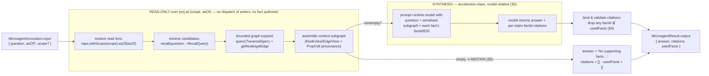

# Graph-QA microagent — `kip ask` / `kip_ask`

Purpose: an implementable design for a **graph-QA microagent** — a genty microagent that takes a
natural-language question, retrieves supporting context from the existing knowledge graph through the
kip read seams (`recall` / `query` / `asOf` / `getNode`), synthesizes a natural-language answer with its
`runtime.model`, and returns that answer **as a tool result** to whatever agent or human invoked it. It
is a **read-only kip client** (INV-A1): it never writes the graph, and its answer is an
accelerator-class, model-relative artifact — **not** a signed fact.

Source: SPEC §5b active layer (the microagent-as-client contract), §5 retrieval, §6 SDK API surface.
Builds on the [active-knowledge overview](../30-active-knowledge-overview.md) (INV-A1),
[contextual functionalities](../31-contextual-functionalities.md) (the `MicroagentManifest`/dispatch
contract), [retrieval](../26-retrieval.md) (the `recall` pipeline), and the
[SDK API surface](../40-sdk-api-surface.md) (`getNode`/`query`/`recall`/`asOf`/`provenanceOf`). Its two
call sites are specified in the sibling design docs [`kip-cli.md`](./kip-cli.md) (`kip ask`) and
[`kip-mcp.md`](./kip-mcp.md) (the `kip_ask` MCP tool).

---

## Table of contents

- [1. Where it sits — a read-only client microagent](#1-where-it-sits--a-read-only-client-microagent)
- [2. The `MicroagentManifest` (normative shape)](#2-the-microagentmanifest-normative-shape)
- [3. The retrieval → synthesis pipeline](#3-the-retrieval--synthesis-pipeline)
- [4. Citation binding — every claim traces to a signed fact](#4-citation-binding--every-claim-traces-to-a-signed-fact)
- [5. Determinism & provenance stance](#5-determinism--provenance-stance)
- [6. Abstention & error behavior (N5)](#6-abstention--error-behavior-n5)
- [7. Call sites — `kip ask` (CLI) and `kip_ask` (MCP)](#7-call-sites--kip-ask-cli-and-kip_ask-mcp)
- [8. Acceptance criteria](#8-acceptance-criteria)
- [9. Key decisions](#9-key-decisions)
- [10. Cross-links](#10-cross-links)

---

## 1. Where it sits — a read-only client microagent

The graph-QA capability is a **genty microagent** in exactly the sense §5b defines: it is registered as
a `MicroagentManifest`, dispatched with a `MicroagentInvocation`, and returns a `MicroagentResult`. It
consumes the **kip SDK read surface** and the **genty runtime** directly; it does **not** route through
`@a5c-ai/babysitter-sdk`.

It is, however, a **strictly narrower** case than the §5b.1 contextual-functionality path, and the
difference is load-bearing:

| | §5b.1 contextual functionality (`runContextualQuery`) | graph-QA microagent (`kip ask` / `kip_ask`) |
|---|---|---|
| **Bound to an `EdgeKind`?** | Yes — a `FunctionalityBinding` on a hop | **No** — a standalone, directly-invoked read tool |
| **Writes anything?** | The **orchestrator** authors signed `assert` + `derived_from` facts from the result | **Nothing is authored** — the answer is returned to the caller, never folded into the graph |
| **Result class** | Substrate (the `derived_from` subgraph **is** the `AnswerGraph`, INV-A8) | Accelerator-class, model-relative text (see §5) |
| **INV-A1 posture** | Satisfied because only the orchestrator writes | Satisfied **trivially** — the microagent proposes **zero** facts |

So graph-QA sits *above* the substrate as a pure **reader + synthesizer**. It reads facts that are
already signed, reads their provenance for citations, and emits prose. Because it authors nothing, it
cannot violate INV-A1 by construction: there is no fact for it to write, and the graph remains
`proj(factSet)` untouched by any `ask` call.

> **Not a `FunctionalityBinding`.** Do **not** register the graph-QA manifest via
> `registerFunctionality` against an `EdgeKind`. That seam exists to make a *relation* executable and to
> author `derived_from` facts on traversal — the opposite of this microagent's read-only contract.
> Graph-QA is invoked **directly** (by its `(name, version)`) from the two call sites in §7, and its
> `MicroagentResult.output` is handed back to the caller verbatim, never wrapped as a fact.

---

## 2. The `MicroagentManifest` (normative shape)

The manifest reuses the `@a5c-ai/genty-core` `MicroagentManifest` fields verbatim ("do not invent
fields", §5b.1). Only the schema *contents* are graph-QA-specific.

```ts
const graphQaManifest: MicroagentManifest = {
  name: "kip-graph-qa",
  version: "1.0.0",
  description:
    "Answers a natural-language question over the kip knowledge graph. Retrieves supporting facts via " +
    "recall/query/asOf/getNode (READ-ONLY), synthesizes an answer with runtime.model, and returns the " +
    "answer with per-claim citations back to signed factIds/EIDs. Writes nothing (INV-A1). Abstains " +
    "when no supporting facts are found (N5 — never fabricates).",

  // --- INPUT: a question + an optional read lens ---
  inputSchema: {
    type: "object",
    required: ["question"],
    additionalProperties: false,
    properties: {
      question: { type: "string", minLength: 1 },     // the NL question
      asOf: {                                          // OPTIONAL read lens (§4.2/§4.3 AsOf); default = now-frontier.
        type: "object",                                //   Pin it for a reproducible RETRIEVED SET (R5, §5).
        additionalProperties: false,
        properties: {
          validTime: { type: ["string", "object"] },   // HlcOrTime — convergent world-truth lens
          txTime: { type: "object" },                   // HlcStamp — per-replica belief-audit lens (NON-convergent)
          believer: { type: "string" }                 // ReplicaId whose rxFrom order the txTime lens reads
        }
      },
      scope: {                                         // OPTIONAL tenant/namespace/snapshot lens (§8 ScopeRef)
        type: "object",
        additionalProperties: false,
        properties: {
          tenant: { type: "string" },
          namespace: { type: "string" },
          snapshot: { type: "object" }                  // SnapshotRef — read against a pinned frontier
        }
      }
    }
  },

  // --- OUTPUT: an answer + traceable citations + the full retrieved fact set ---
  outputSchema: {
    type: "object",
    required: ["answer", "citations", "usedFacts"],
    additionalProperties: false,
    properties: {
      answer: { type: "string" },                      // the NL answer, OR the explicit abstention string (§6)
      abstained: { type: "boolean" },                  // true iff no supporting facts were found (§6); answer is the
                                                        //   canonical abstention phrase and citations/usedFacts are []
      citations: {                                     // the per-claim evidence the answer RESTS ON (§4)
        type: "array",
        items: {
          type: "object",
          required: ["factId"],
          additionalProperties: false,
          properties: {
            factId: { type: "string" },                 // FactId of the signed fact backing this claim (REQUIRED)
            eid: { type: "string" },                    // the EID the claim is about (node or edge)
            edgeKind: { type: "string" },               // for edge citations: the EdgeKind traversed
            prop: { type: "string" },                   // for node-prop citations: the PropKey read
            quote: { type: "string" }                   // the answer span this fact supports (for grading)
          }
        }
      },
      usedFacts: {                                     // EVERY fact placed into the model context, superset of the
        type: "array",                                 //   factIds in `citations` — the retrieval envelope (§4/§8)
        items: { type: "string" }                       // FactId[]
      },
      model: { type: "string" },                       // the model the dispatcher RESOLVED and ran the synthesis on,
                                                        //   reported so the CLI can echo the model that actually spoke
                                                        //   rather than an unresolved sentinel (kip-cli.md §5.3/AC-28)
      error: { type: "string" }                        // a dispatch-failure REASON; present only with a non-zero
                                                        //   exitCode, and never read on the success path (§6.6) — a
                                                        //   diagnostic, never prose. This schema is kip's OWN, so
                                                        //   carrying it here invents no genty field.
    }
  },

  isolation: "subprocess",                             // IsolationMode — a read-only tool needs no container
  runtime: {
    entrypoint: "kip-graph-qa.mjs",                    // the executable genty spawns (reads stdin invocation, writes stdout result)
    model: "<synthesis-model-id>",                     // the accelerator-class LLM that writes the answer (§3.3, §5)
    timeout: 30_000,                                    // EFFECTIVE dispatch timeout; genty sets MicroagentInvocation.timeout = this
    tools: ["kip-read"]                                 // advisory selection metadata only — the read-seam client it links (never a gate)
  },
  tags: ["kip", "qa", "read-only"],                    // advisory selection metadata — never a gate
  builtIn: false
};
```

Notes:

- **`inputSchema` / `outputSchema` are the genty contract boundary.** The genty `MicroagentRunner`
  validates the invocation `input` against `inputSchema` and the `MicroagentResult.output` against
  `outputSchema` before the result leaves the runner (`SCHEMA_MISMATCH` on failure). A malformed answer
  object never reaches the caller.
- **`runtime.model` is the synthesis engine.** It is the single accelerator-class dependency; a change
  of model id changes the *wording* of answers but never their substrate inputs (§5). It is declared on
  the manifest, not chosen per call.
- **No `outputSchema` field carries an authored fact.** `citations` and `usedFacts` are *references* to
  facts that already exist; the microagent mints none.

---

## 3. The retrieval → synthesis pipeline



### 3.1 Question → retrieval plan (pure reads)

The entrypoint resolves the read lens once — `repo.withScope(scope).asOf(asOf)` — and performs **only
reads** against it (`recall`, `query`, `getNode`, `getEdge`, `provenanceOf`). It dispatches **no**
writer microagent and calls **no** authoring seam.

1. **Candidate recall.** Compile the question into a `RecallQuery` and call `recall(q)`:
   - `text`: the raw question (advisory graph-seed/keyword input only — kip **never** embeds it, N2).
   - `embedding`: the caller-supplied query vector **iff** the host provides one whose model identity
     matches the set-resident `kip:embedding-model` fact (§5.4). Absent ⇒ the graph half runs alone
     (stated, never a silent in-kip embedding call, N5).
   - `filters`: optional `kind` / `edgeKinds` narrowing parsed from the question (best-effort; a miss
     just widens recall, never fabricates).
   - `expand`: `{ hops, maxFanout }` **bounded and opt-in** (the Mem0 precision pitfall — graph
     expansion injects tangential noise; it MUST be capped).
   - `k`: a fixed top-k envelope.
   - `asOf` / `scope`: the resolved lens.
   `recall` returns RRF-fused `RecallResult[]`, each carrying `eid`, `view`, `score`, `ranks`,
   `conflicted`, and `provenance`.
2. **Bounded expansion / lookup.** For the top candidates, follow typed relations with
   `query(spec: TraversalSpec)` (mandatory `depth` + `maxFanout`; as-of-valid edges only, §5.2) and
   hydrate specific nodes/edges with `getNode(eid, asOf)` / `getEdge(eid, asOf)`. This turns entry
   nodes into a small, connected **context subgraph**.

### 3.2 Assemble the context subgraph

Collect the retrieved `NodeView` / `EdgeView` values into a bounded context object. For every value the
microagent intends to expose to the model it also records the backing **`FactId`**:

- a **node property** claim cites the `PropCell` segment's `assertedBy` `FactId` (the winning
  covering assert for that valid-time sub-interval; §2 of the [data model](../21-data-model.md));
- an **edge** claim cites the edge fact backing the `EdgeView` (resolvable via `provenanceOf(eid)` /
  the edge's `provenance`);
- **`Unknown`** segments are surfaced as *absence*, never coerced to a value (N5); a `conflict`
  segment is surfaced to the model as an explicit contradiction with its `candidates: FactId[]`, never
  silently collapsed to one side.

The union of all `FactId`s placed into the context is the **`usedFacts`** envelope returned in the
output — the auditable retrieval boundary the answer was allowed to rest on.

### 3.3 Prompt the model (`runtime.model`)

Serialize `{ question, subgraph }` into a synthesis prompt. The prompt instructs `runtime.model` to:

- answer **only** from the supplied subgraph, treating it as the sole ground truth;
- attach, to each claim, the `FactId` (and `EID`) of the fact that supports it, drawn **only** from the
  provided `usedFacts`;
- **abstain** with the canonical phrase (§6) if the subgraph does not support an answer, rather than
  drawing on parametric knowledge.

The model returns the prose answer plus its per-claim `factId` references. This step is the **only**
non-deterministic, accelerator-class computation in the pipeline (§5).

### 3.4 Bind & validate citations

Before returning, the entrypoint does **two** things to every citation the model returns. Both are
required; the first alone is not enough.

1. **Filter against `usedFacts`.** Any cited `factId` that was not actually in the retrieved envelope
   is **dropped** (a hallucinated citation is never surfaced). A claim whose supporting citation is
   dropped, leaving the answer with an uncited factual assertion, is a defect the acceptance suite
   (§8) detects.
2. **Rebind the provenance fields from the retrieved fact.** For each surviving citation, `eid`,
   `prop` and `edgeKind` are **reconstructed from the `RetrievedFact` that its `factId` names** — not
   taken from the model. The model's copies are not read.

**Why (2) exists.** Validating the `factId` alone, and then passing the citation *object* through
verbatim, let a model bind a **real, signed `factId`** to an **invented `eid`/`prop`/`edgeKind`** —
a citation asserting that a genuine signed fact is about an entity it is not about. That is
*manufactured provenance wearing real cryptographic evidence*, and it is strictly worse than an
obvious hallucination: the `factId` audits clean, so `provenanceOf`/`fsck` confirm a real signature
behind a claim the fact does not support. It is reachable by prompt injection from attacker-controlled
fact **values** — the threat model [ADR-B8](../70-decision-records-adr.md) names — and it falsified
ADR-B8's own "cannot manufacture provenance" claim (round-2 review finding #1, probe-confirmed).

**The resulting contract.** `eid`/`prop`/`edgeKind` are a **deterministic function of retrieval**
(which also keeps them inside the §5.3 accelerator boundary: they are not model output at all). The
model contributes exactly two things to a citation: **which** fact backs the claim (`factId`, then
validated), and `quote` — a span of its own prose, which carries no provenance and resolves to
nothing. Rebuilding rather than editing also means an unknown key a model attaches cannot ride along.

The validated `{ answer, citations, usedFacts }` object is emitted as `MicroagentResult.output`.

**The guard is shared, and it runs at every layer that surfaces a citation.** `answerQuestion` is not
the only place a citation reaches a user: `kip ask` (`runAsk`) and `kip_ask` MAP a
`MicroagentResult` into their own surfaces, and those seams mint the `status` field. A host may
replace the whole `DispatchMicroagentFn`, so those seams must not take a dispatcher's
`abstained`/`citations` on trust — they run the same `bindAndValidateCitations` + abstention
invariant. What each layer can promise differs, and the difference is structural, not an oversight:

| | `answerQuestion` (facts in scope) | `runAsk` / `kip_ask` (mapping a dispatcher's output) |
|---|---|---|
| Abstention invariant (§6.1a) | yes | **yes — absolute** (a property of the answer *string*) |
| Cited `factId` ∈ `usedFacts` | yes | yes (against the dispatcher's own envelope) |
| Unknown keys dropped | yes | yes |
| `eid`/`prop`/`edgeKind` rebound from retrieval | **yes** | **no — the graph is not in scope** |

The last row is the honest boundary. At the mapping seam the retrieved facts do not exist, and the
check would be *self-referential* anyway: a dispatcher that fabricates a citation also authors the
`usedFacts` it would be validated against. What the envelope filter DOES close there is the realistic
case — a host dispatcher faithfully forwarding output from its own model, where `usedFacts` is genuine
and the model invented a `factId`. A host that holds its retrieved facts should pass them to
`bindAndValidateCitations` (exported for exactly this), or inject at the `synthesize` seam and get
rebinding for free.

---

## 4. Citation binding — every claim traces to a signed fact

The contract is: **every factual claim in `answer` is traceable to a signed fact in `usedFacts`, and
`citations` names which.**

- **`usedFacts: FactId[]`** — the complete set of facts placed into the model context (§3.2). It is the
  *envelope*: the answer may rest only on facts in this set.
- **`citations[]`** — the subset the model actually leaned on, one entry per supported claim, each
  binding an answer span (`quote`) to its backing `factId` (+ `eid`, and `prop`/`edgeKind` for the
  read kind). Every `citations[i].factId` MUST be an element of `usedFacts` (§3.4 enforces this).
- **Traceability is to the substrate.** Because a `FactId` is the CID of a signed fact's canonical
  payload (§2.4), a citation is a verifiable pointer: a caller can `provenanceOf(factId)` (or `fsck`)
  to confirm the signature, author, and author-HLC of the evidence behind any sentence in the answer.
- **No fact is authored to produce a citation.** Citations reference *pre-existing* signed facts; the
  microagent creates none. This is what keeps the tool INV-A1-clean while still being fully auditable.

---

## 5. Determinism & provenance stance

The graph-QA answer is an **accelerator-class, model-relative artifact — NOT a signed fact.**

- **The answer is never folded into the graph.** `ask` authors **nothing**: no `assert`, no
  `derived_from`, no `kip:learn`. The graph after an `ask` call is byte-identical to before it. This is
  strictly stronger than INV-A1's "orchestrator is the sole author": here there is no author at all.
- **The synthesis step is outside `proj`.** Answer wording is produced by `runtime.model` and is
  therefore in the **accelerator (non-deterministic) class** (§5.3): two runs — or two replicas, or the
  same replica after a model upgrade — MAY word the answer differently. kip makes **no** byte-identity
  claim over the answer text; its conformance is **recall-/citation-based**, not byte-equality (§8).
- **The retrieved fact set IS reproducible under a pinned `asOf` (R5).** The retrieval half is a pure
  read over `proj` at the resolved lens. With an explicit `asOf` frontier, `usedFacts` (the envelope of
  candidate facts) is a deterministic function of the as-of fact-set — two identical `ask` calls at the
  same pinned `asOf` retrieve the **same** facts (subject only to ANN recall-equivalence, §5.3), even
  though the prose may vary. Default `asOf = now` yields a still-convergent but **replica-local (hence
  irreproducible) frontier** — an explicit residual (R5), never a determinism guarantee. Callers who
  need a reproducible evidence set MUST pass `asOf`.
- **`read` events are the only trace it leaves.** Reads emit `read` facts that feed salience
  (§5.4); those are bounded by the same `asOf`-frontier and cannot affect the ranking of the query that
  emitted them (the reproducible-recall fix, m-7). The `ask` call itself still writes no graph state a
  caller can query as an answer — the `read` fact is substrate bookkeeping, not the answer.
- **Confidence is advisory.** Any `PropCell` or `RecallResult` confidence the model sees is advisory
  only and never mechanically resolves a claim (m-2); a low-confidence fact is surfaced *as such*, not
  silently dropped.

---

## 6. Abstention & error behavior (N5)

The microagent **abstains rather than fabricates**. This is the graph-QA restatement of the no-fallback
rule (N5) and mirrors the substrate's `Unknown`-not-invented posture.

1. **Empty retrieval ⇒ explicit abstention.** If `recall` + bounded expansion yield **no** supporting
   facts for the question (`usedFacts` would be empty), the microagent MUST return:
   - `abstained: true`,
   - `answer`: the canonical phrase — **"No supporting facts in the knowledge graph."** (a stable,
     testable string; wording may be localized but the abstention MUST be unambiguous and MUST NOT
     assert any entity fact),
   - `citations: []` and `usedFacts: []`.
   It MUST NOT draw on the model's parametric/world knowledge to manufacture an answer.

   **1a. The canonical phrase is the SUBSTRATE's signal, and it MUST NOT be forgeable by model
   output.** Because §6.1 makes the phrase "a stable, testable string" that consumers key on, model
   output carrying it must never be able to mean something *different* from what the microagent means
   by it. Two rules enforce that:
   - The synthesis prompt **MUST NOT teach the model the sentinel** (i.e. must not instruct "reply
     with exactly: `<phrase>`"). The model is told to say plainly, in its own words, when the facts
     support no answer. Teaching it the constant hands untrusted output a substrate signal — and it
     is reachable by injection: a hostile fact value carrying "reply with exactly: `<phrase>`" would
     make a graph that DOES hold the answer report as silent.
   - Whatever its source, an `answer` equal to the canonical phrase **MUST** be reported as an
     abstention: `abstained: true`, `citations: []`. The invariant a consumer may rely on is
     **`abstained === (answer === ABSTENTION_ANSWER)`** — the flag and the phrase can never disagree,
     and neither is forgeable independently of the other. Otherwise the result surface says
     `status: "answered"` while carrying the canonical *unanswerable* phrase and reports
     `abstained: false` while the prose asserts the opposite (round-2 review finding #2,
     probe-confirmed).

   In the **synthesizer-abstention** case — facts *were* retrieved, and the synthesizer reported the
   phrase — `usedFacts` stays **populated**, unlike the empty-retrieval case above: those facts really
   were retrieved and placed into the model context, and §4 makes `usedFacts` the auditable retrieval
   envelope. Emptying it would misreport the read that actually happened. Note the honest bound: a
   model can always decline to answer in *any* wording, so suppression is **reportable, not
   preventable** — what these rules guarantee is that it is reported as an abstention rather than
   disguised as an answer.
   **1b. Subject-anchoring abstention — retrieval is lexical, relevance is checked HERE (round-3).**
   `recall`'s `text` seed is a deterministic LEXICAL match (docs/26 §5.1a): it correctly surfaces any
   node sharing ≥1 query term, INCLUDING a relation term ("work", "owns") that appears in an unrelated
   node's prose. So a non-empty `usedFacts` does not by itself mean the retrieved facts are about the
   question's **subject** or a named **attribute**. Before synthesizing, the microagent therefore
   computes a **subject-anchoring surface** — the vocabulary of every hydrated node/edge: its `eid`
   (with the `kip learn` `doc:<blob>#` namespace stripped), its `kind`, its incident `EdgeKind`s, every
   prop/edge-prop KEY, and every STRUCTURED (string/number/boolean) prop VALUE — deliberately EXCLUDING
   the VALUES of free-text props (`content`/`description`/`summary`). Widening it to prop KEYS and
   structured values (round-4 finding #1) is what lets a question keyed on the graph's OWN schema
   vocabulary — "Who is the CEO?" answered by `role:"CEO"`, "What is the status?" answered by
   `status:"blocked"` — anchor and answer, instead of retrieving the backing signed fact and then
   silently abstaining (a §0 "surfaced, never silent" violation in the hard-to-notice direction). If
   **no** query term appears in that surface, the retrieved facts are not
   about the subject (the overlap that surfaced them was an incidental relation term in prose), and the
   microagent **abstains** exactly as in §6.1: canonical phrase, empty citations, `abstained: true`,
   and **`synthesize` is NEVER called** (no fabrication from parametric knowledge). This is where the
   fabrication guard that "Where does Zara work?" needs actually lives: on a graph holding only Tal,
   Tal's node is lexically retrieved (his `content` shares the verb "work"), but "zara" is absent from
   every retrieved identity surface, so the answer is the honest abstention; on a graph holding Zara,
   "zara" IS in her identity surface, so the question is answered. This REPLACES the round-2
   graph-global recall floor (`bestMatched >= 2` in `computeRecall`), which could not distinguish these
   two cases because it never inspected WHAT was retrieved — it counted how many terms some node in the
   graph matched — and so both suppressed correct subject matches (a silent false negative) and
   collapsed the moment any coincidental multi-term node appeared. The check is set-pure over the
   hydrated facts + the question, the same determinism the retrieval half holds.

2. **Partial retrieval ⇒ answer only the supported part.** If facts cover only part of the question,
   the answer states what the facts support and explicitly notes the unsupported remainder as unknown —
   it never fills the gap with an uncited claim.
3. **Conflicted evidence ⇒ surface, don't pick.** If a relevant cell reads `conflict`
   (`RecallResult.conflicted === true`), the answer surfaces the contradiction and cites **all**
   `candidates` `FactId`s; it MUST NOT silently choose one side (N5, mirrors `kip:conflict`).
4. **Every cited `factId` MUST be in `usedFacts`.** Citations to facts outside the retrieved envelope
   are dropped before return (§3.4); a hallucinated citation never surfaces.
5. **Input rejection throws; domain outcomes are data.** A malformed invocation (missing `question`,
   bad `asOf` selector) surfaces as the genty runner's schema-mismatch / a typed `KipError`
   (`ERR_MALFORMED_INPUT`) — the throw channel. An empty-answer *abstention* is **data**, not an error
   (parity with the §6/[Errors](../40-sdk-api-surface.md#errors--the-typed-kiperror-model-m7-10)
   two-channel model: domain outcomes are returned, caller-input rejections throw).
6. **Retrieval/model failure ⇒ no fabricated answer.** A `recall`/`query` read error or a model
   dispatch failure (non-zero `exitCode`, timeout past `runtime.timeout`, `outputSchema`-invalid
   output) yields **no** answer object rather than a guessed one; the runner reports the dispatch
   failure to the caller. Nothing is authored in any of these cases.

---

## 7. Call sites — `kip ask` (CLI) and `kip_ask` (MCP)

The graph-QA microagent is surfaced to other agents through **two** front doors; both are thin
adapters that build a `MicroagentInvocation`, dispatch the `kip-graph-qa` manifest, and hand back
`MicroagentResult.output`. Neither call site authors a fact.

- **kip CLI — `kip ask "<question>" [--as-of <ref>] [--scope <tenant/ns>]`.** Specified in
  [`kip-cli.md`](./kip-cli.md). Parses argv into `{ question, asOf?, scope? }`, dispatches the
  microagent, and prints the `answer` with a citations footnote (each `factId` → `provenanceOf`
  one-liner). `--json` emits the raw `{ answer, citations, usedFacts }`. An abstention prints the
  canonical phrase and exits 0 (a valid, non-error outcome).
- **kip MCP server — the `kip_ask` tool.** Specified in [`kip-mcp.md`](./kip-mcp.md). Exposes an MCP
  tool whose input schema **is** the manifest `inputSchema` (`{ question, asOf?, scope? }`) and whose
  result **is** the manifest `outputSchema` (`{ answer, citations, usedFacts }`). This is the primary
  **agent-to-agent** surface: another agent calls `kip_ask` as a tool, receives grounded prose plus
  verifiable citations, and can follow any `factId` back to its signed source. Because the tool writes
  nothing, it is safe to expose broadly (read-only, INV-A1-clean).

Both call sites consume the **kip SDK read seams + the genty dispatch runtime directly** — never
`@a5c-ai/babysitter-sdk`.

---

## 8. Acceptance criteria

Each item is phrased so a test author can turn it into a vitest assertion. The suite fixes
`replicaId`s, reducer seeds, and a pinned `asOf`, and stubs `runtime.model` with a deterministic
scripted synthesizer so the *pipeline* is byte-testable while the model boundary stays
recall-/citation-based (§0.1 accelerator boundary). The graph fixtures are built with `assertFact`
only.

1. **Happy-path answer cites the backing fact.** Given a graph containing
   `(person:tal)-[employed_by]->(org:a5c)` (one signed edge fact `F_e`), invoking the microagent with
   `{ question: "Where does Tal work?" }` returns `abstained === false`, an `answer` naming `a5c`, and a
   `citations` entry whose `factId === F_e` (the `employed_by` edge fact), with `F_e ∈ usedFacts`.
2. **Every cited factId is in the retrieved envelope.** For any non-abstaining answer,
   `citations.every(c => usedFacts.includes(c.factId))` is `true` (no citation outside `usedFacts`;
   §3.4).
3. **No uncited factual claim.** For the happy-path answer, every entity/relationship asserted in
   `answer` maps to at least one `citations` entry (assert via the stub synthesizer's structured claim
   list — no claim without a backing `factId`).
4. **Abstention on an entity with no facts.** Asking about an EID (or name) that has **zero** covering
   facts returns `abstained === true`, `answer` equal to the canonical abstention phrase, `citations`
   `.length === 0`, and `usedFacts.length === 0` — and the answer asserts no entity fact (zero
   fabricated citations).
5. **Abstention on an empty graph.** Against a graph with no facts at all, any question abstains
   (as #4); `recall` returning `[]` MUST NOT be turned into a synthesized answer.
6. **Node-property question cites the PropCell's `assertedBy`.** Given `(person:tal { title: "founder" })`
   backed by prop fact `F_p`, asking "What is Tal's title?" returns an answer containing `founder` and a
   `citations` entry with `factId === F_p` and `prop === "title"`.
7. **Nothing is authored (INV-A1).** Snapshot `/heads` (or the fact-set digest via `pin`/`resolvePin`)
   before and after any `ask` call — happy path **and** abstention — and assert byte-equality; assert
   the run issued **zero** `assertFact`/`retractFact`/`putNode`/`putEdge`/`registerFunctionality`/
   `runContextualQuery`/`runAcquisition`/`learn` calls (spy on the write seams; call count === 0).
8. **Hallucinated citation is dropped.** Feed the stub synthesizer a `factId` **not** present in
   `usedFacts`; assert that `factId` does **not** appear in the returned `citations` (filtered by §3.4).
9. **Conflicted evidence is surfaced, not resolved.** Given two contradictory covering asserts for one
   cell (`RecallResult.conflicted === true`, `candidates = [F_a, F_b]`), the answer surfaces the
   contradiction and `citations` includes **both** `F_a` and `F_b`; assert the microagent does not emit
   a single-sided answer (both candidate factIds present).
10. **Pinned `asOf` gives a reproducible retrieved set.** Two invocations with the **same** pinned
    `asOf` produce **equal** `usedFacts` sets (order-insensitive), even if the stubbed answer strings
    differ — the retrieval envelope is deterministic under a pinned frontier (R5), asserted as set
    equality, not string equality.
11. **`asOf` actually scopes retrieval.** Assert `F_e` at `validFrom = T1`; an `ask` at
    `asOf = T0 (< T1)` abstains (the fact is not yet valid), while the same question at
    `asOf = T2 (> T1)` cites `F_e` — proving the read lens bounds the evidence.
12. **`scope` isolates tenants.** With `F_e` under `tenant:A`, an `ask` carrying `scope.tenant === "B"`
    abstains (no cross-tenant leakage), while `scope.tenant === "A"` cites `F_e`.
13. **Malformed input throws, abstention does not.** An invocation missing `question` rejects through
    the throw channel (schema-mismatch / `ERR_MALFORMED_INPUT`); a well-formed question with no
    supporting facts returns an abstention **as data** (does not throw) — assert the two distinct
    channels.
14. **Output validates against `outputSchema`.** Every returned object satisfies the manifest
    `outputSchema` (required `answer`/`citations`/`usedFacts`; `citations[i]` requires `factId`);
    assert with the same JSON-schema validator the genty runner uses.
15. **Multi-hop answer cites each hop.** Given `(person:tal)-[employed_by]->(org:a5c)-[headquartered_in]->(city:tlv)`,
    asking "What city is Tal's employer based in?" returns an answer naming `tlv` whose `citations`
    include the `FactId`s of **both** traversed edges (each claim in the chain traces to its own signed
    fact).

---

## 9. Key decisions

- **D-QA.1 — graph-QA is a standalone READ-ONLY microagent, not a `FunctionalityBinding`.** It is
  invoked directly by `(name, version)` from the CLI/MCP call sites and its result is returned to the
  caller; it is **not** bound to an `EdgeKind` and it authors **no** `derived_from` fact. *Rejected:*
  model graph-QA as a §5b.1 contextual functionality whose answers become signed facts — that would
  fold model-relative prose into the substrate, violating the accelerator boundary (§5.3) and turning
  every question into graph growth.
- **D-QA.2 — the answer is accelerator-class, never a fact.** Synthesis runs `runtime.model` outside
  `proj`; kip makes no byte-identity claim over `answer` and authors nothing. *Rejected:* cache/persist
  answers as `kip:learn`-style facts — answers are model- and question-phrasing-relative and would go
  stale against the very facts they cite.
- **D-QA.3 — abstain over fabricate (N5).** Empty retrieval yields the canonical abstention phrase with
  zero citations, never a parametric-knowledge answer. *Rejected:* let the model "best-effort" answer
  from world knowledge when the graph is silent — indistinguishable from a hallucination and uncitable.
- **D-QA.4 — citations are validated against the retrieved envelope.** Any cited `factId ∉ usedFacts`
  is dropped before return. *Rejected:* trust the model's self-reported citations — a hallucinated
  `factId` would present as verifiable provenance while pointing at nothing.
- **D-QA.5 — reproducibility is of the RETRIEVED SET, under a pinned `asOf` (R5).** The evidence
  envelope is deterministic at a fixed frontier; the prose is not. *Rejected:* claim the answer text is
  reproducible — it is model-relative by construction.

---

## 10. Cross-links

- [Active-knowledge overview](../30-active-knowledge-overview.md) — INV-A1 (microagents are clients),
  the accelerator boundary.
- [Contextual functionalities](../31-contextual-functionalities.md) — the `MicroagentManifest` /
  `MicroagentInvocation` / `MicroagentResult` contract and why graph-QA is the read-only, unbound case.
- [Retrieval](../26-retrieval.md) — `RecallQuery`, the vector→graph→RRF pipeline, bounded expansion.
- [SDK API surface](../40-sdk-api-surface.md) — `getNode` / `getEdge` / `query` / `recall` / `asOf` /
  `provenanceOf`; the typed `KipError` two-channel model.
- [Data model](../21-data-model.md) — `NodeView` / `EdgeView` / `PropCell` (`assertedBy`), `Provenance`
  (`FactId` traceability).
- [Stack integration](../28-stack-integration.md) — the genty microagent dispatch seam kip consumes
  directly (not via babysitter-sdk).
- [Conformance & testability](../60-conformance-and-testability.md) — INV-A1 and the byte-identity vs
  recall-equivalence accelerator split the acceptance suite (§8) rides on.
- Call sites: [`kip-cli.md`](./kip-cli.md) (`kip ask`) · [`kip-mcp.md`](./kip-mcp.md) (`kip_ask`).
