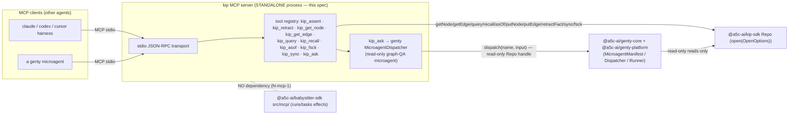

# kip MCP server — standalone graph read/write + graph-QA for agents

> Purpose: an implementable design spec for a **standalone** kip **MCP (Model Context Protocol)
> server** that exposes the kip knowledge graph — read, write, and a graph-QA tool — to *other*
> agents (any MCP-speaking harness) over stdio. The server is a **memory-substrate front door**: it
> consumes the kip SDK `Repo` surface ([`../40-sdk-api-surface.md`](../40-sdk-api-surface.md)) and the
> genty agent-platform/runtime/core contract ([`../28-stack-integration.md` §genty](../28-stack-integration.md#integration-genty))
> **directly**, and turns each into a named MCP tool.

**Source:** the real kip `Repo` interface (`packages/kip-sdk/src/index.ts`, mirrored in
[`../40-sdk-api-surface.md`](../40-sdk-api-surface.md)); the genty microagent contract
(`MicroagentManifest`/`MicroagentInvocation`/`MicroagentResult`/`MicroagentDispatcher`/
`MicroagentRunner`, per [`../28-stack-integration.md` §genty](../28-stack-integration.md#integration-genty));
the SPEC active layer (§5b) and §4c seams. Every tool below names the exact `Repo` method it calls.

> **Status tags** (same convention as [`../28-stack-integration.md`](../28-stack-integration.md)):
> **GROUNDED-NEW** — the underlying kip/genty surface is real code (cited), but the MCP wiring is
> new and specified here; **SPECULATIVE** — plausible but not yet in code or SPEC, labeled as such.

> **Hard architectural boundary (normative, N-mcp-1).** This server is **STANDALONE**. It has its own
> entrypoint and its own process, and it consumes `@a5c-ai/kip-sdk` + genty (`@a5c-ai/genty-core`,
> `@a5c-ai/genty-platform`) **directly**. It **MUST NOT** be routed through `@a5c-ai/babysitter-sdk`
> and **MUST NOT** import or reuse babysitter-sdk's `src/mcp/` tool surface (`tools/runs.ts`,
> `tools/tasks.ts`, …). babysitter-sdk's MCP surface is a *run-effect* channel with a different
> responsibility (run/task effects); kip's MCP surface is a *memory-substrate* channel. The two are
> deliberately separate scopes and share no code. A kip MCP tool that reached the graph by way of a
> babysitter-sdk import is a conformance failure.

## Table of contents

- [1. Overview — where the server sits](#1-overview--where-the-server-sits)
- [2. Process model and transport](#2-process-model-and-transport)
- [3. Launch, repo-dir and identity resolution](#3-launch-repo-dir-and-identity-resolution)
- [4. Tool surface overview (read vs write)](#4-tool-surface-overview-read-vs-write)
- [5. Read tools](#5-read-tools)
- [6. Write tools](#6-write-tools)
- [7. Graph-QA tool — `kip_ask`](#7-graph-qa-tool--kip_ask)
- [8. SDK method mapping](#8-sdk-method-mapping)
- [9. Error model and MCP error mapping](#9-error-model-and-mcp-error-mapping)
- [10. Read-only mode and capability gating](#10-read-only-mode-and-capability-gating)
- [11. Acceptance criteria](#11-acceptance-criteria)
- [12. Cross-links](#12-cross-links)

---

## 1. Overview — where the server sits

**Thesis.** kip is the memory substrate; the kip MCP server is the *client-facing adapter* that lets
any MCP-speaking agent (Claude, codex, cursor, a genty microagent, a babysitter run's harness) read
and write the graph through a stable, JSON-schema'd tool surface — without linking the kip SDK into
that agent. One process opens exactly one memory repo (`Repo` via `open(OpenOptions)`) and serves it.



**What it exposes.** Ten tools split into three groups:

- **Read tools** (never author a fact): `kip_get_node`, `kip_get_edge`, `kip_query`, `kip_recall`,
  `kip_asof`, `kip_fsck`.
- **Write tools** (author signed facts / mutate the local set): `kip_assert`, `kip_retract`,
  `kip_sync`.
- **Graph-QA tool** (read-only, dispatches a genty microagent): `kip_ask`.

Status: **GROUNDED-NEW** — the `Repo` methods and genty dispatch symbols are real; the MCP server that
wraps them is the new artifact this doc specifies.

---

## 2. Process model and transport

### 2.1 Transport = stdio (normative)

The server speaks **MCP over stdio** (newline-delimited JSON-RPC 2.0 on `stdin`/`stdout`), the same
transport every harness's MCP client already drives. `stdout` carries **only** protocol frames;
**all** diagnostics go to `stderr` (a stray non-JSON line on `stdout` corrupts the stream). No HTTP,
SSE, or WebSocket transport is in scope for M0; a future streamable-HTTP transport is
**SPECULATIVE** and out of scope here.

### 2.2 One process, one repo

The server process holds a single `Repo` for its lifetime:

1. On startup it resolves configuration (§3), calls `open(OpenOptions)` from `@a5c-ai/kip-sdk`, and
   caches the returned `Repo`.
2. It advertises the tool list (§4) in the MCP `initialize`/`tools/list` handshake.
3. Each `tools/call` is dispatched to the handler for that tool name, which calls exactly one `Repo`
   method (§8) and maps the result back to an MCP tool result (§9).
4. If `open()` throws (`ERR_MANIFEST_FORK`, `ERR_HASH_ALGO_MISMATCH`, `ERR_MALFORMED_INPUT`), the
   process exits non-zero **before** advertising any tools — the server never comes up half-open.

### 2.3 Result envelope convention

Every tool returns a single MCP content item of type `text` whose `text` is the **JSON-serialized**
result body described per-tool below. Domain outcomes that kip models as *data* (a `null` node, an
empty `AnswerGraph`, a `pin-incomplete` status, a `conflicted` recall row, an `FsckReport` with
`ok:false`) are returned as **ordinary (non-error) results** — they are the answer, not a failure
(mirrors the kip "two channels, never mixed" rule, [`../40-sdk-api-surface.md` §Errors](../40-sdk-api-surface.md)).
Only caller-input rejections and capability denials become MCP errors (§9).

---

## 3. Launch, repo-dir and identity resolution

### 3.1 Entrypoint

The server ships as a **bin** of `@a5c-ai/kip-sdk`:

```jsonc
// packages/kip-sdk/package.json (excerpt)
"bin": { "kip-mcp": "./dist/mcp/server.js" }
```

Launched by a harness's MCP config, e.g.:

```jsonc
// .mcp.json (any harness)
{ "mcpServers": {
    "kip": {
      "command": "npx",
      "args": ["-y", "@a5c-ai/kip-sdk", "kip-mcp", "--dir", "${KIP_REPO_DIR}"],
      "env": { "KIP_REPLICA_ID": "…", "KIP_KEYRING": "…" }
    } } }
```

The implementation lives under `packages/kip-sdk/src/mcp/` (server bootstrap + one file per tool
group). **This directory is kip's own; it is not `babysitter-sdk/src/mcp/`** (N-mcp-1).

### 3.2 Repo-dir resolution (deterministic precedence)

The git dir of the memory repo (`OpenOptions.dir`) is resolved in this fixed order; the first present
wins (no silent fallback beyond this ladder, N5):

1. `--dir <path>` CLI flag.
2. `KIP_REPO_DIR` environment variable.
3. Error. There is **no** implicit cwd default — an unset repo dir is `ERR_MALFORMED_INPUT` at
   startup (a memory repo is never guessed).

`--create-if-missing` maps to `OpenOptions.createIfMissing` and requires a genesis config file
(`--genesis <path>` → `OpenOptions.genesis`); absent both an existing repo and a genesis config,
startup fails rather than inventing genesis parameters.

### 3.3 Identity resolution

- `--replica-id <id>` / `KIP_REPLICA_ID` → `OpenOptions.replicaId` (the stable author replicaId,
  §4b.1). Required; unset is a startup error.
- `--keyring <path>` / `KIP_KEYRING` → loaded into `OpenOptions.keyring` (signing key material that
  MUST chain to the tenant root, §8.1). Required for a server that advertises write tools; a
  `--read-only` server (§10) MAY start without a keyring.
- `--tenant <t>` / `--namespace <ns>` → an initial `ScopeRef` applied via `Repo.withScope(scope)`
  so every tool operates under one tenant/namespace lens (§8). Absent namespace = all namespaces the
  key may read.

The server never *prompts* for key material and never accepts a key over the wire; identity is fixed
at launch by the operator, exactly as the kip SDK expects.

---

## 4. Tool surface overview (read vs write)

| Tool | Group | `Repo` method(s) | Authors a fact? | Blocked in `--read-only`? |
|---|---|---|---|---|
| `kip_get_node` | read | `getNode(eid, asOf?)` | no | no |
| `kip_get_edge` | read | `getEdge(eid, asOf?)` | no | no |
| `kip_query` | read | `query(TraversalSpec)` | no | no |
| `kip_recall` | read | `recall(RecallQuery)` | no | no |
| `kip_asof` | read | `asOf(AsOf)` → `ReadView` | no | no |
| `kip_fsck` | read/ops | `fsck()` | no | no |
| `kip_ask` | graph-QA | genty dispatch over read-only reads | **no** | no |
| `kip_assert` | write | `putNode` / `putEdge` (→ `assertFact`) | **yes** | **yes** |
| `kip_retract` | write | `retractFact` / `tombstone` | **yes** | **yes** |
| `kip_sync` | write/ops | `sync(remote, opts)` | mutates local set | **yes** |

**Read/write boundary is structural.** The three write tools (`kip_assert`, `kip_retract`,
`kip_sync`) are the *only* tools that can change substrate state, and each ultimately appends a signed
fact or set-unions foreign facts. `kip_ask`, despite dispatching an agent, is classified **read** —
its microagent gets only read reads and authors nothing (§7). This mapping is the single source of
truth for the `--read-only` gate (§10).

---

## 5. Read tools

All read tools accept an optional `asOf` selector matching the SDK `AsOf` shape
(`{ validTime?, txTime?, believer? }`, [`../40`](../40-sdk-api-surface.md)); omitted = the current
local frontier.

### 5.1 `kip_get_node`

Calls `Repo.getNode(eid, asOf?)`. Returns the `NodeView` (or `null` when no such node projects at
that `asOf`).

```jsonc
// inputSchema
{ "type": "object", "required": ["eid"], "additionalProperties": false,
  "properties": {
    "eid":  { "type": "string", "description": "entity id (EID)" },
    "asOf": { "$ref": "#/$defs/AsOf" }
  } }
// output body (JSON in the text content)
//   NodeView | null   — { eid, kind, props: Record<PropKey, PropCell>, provenance }
```

### 5.2 `kip_get_edge`

Calls `Repo.getEdge(eid, asOf?)`. Returns the `EdgeView` (or `null`).

```jsonc
{ "type": "object", "required": ["eid"], "additionalProperties": false,
  "properties": { "eid": { "type": "string" }, "asOf": { "$ref": "#/$defs/AsOf" } } }
//   EdgeView | null   — { eid, kind, from, to, props, validFrom, validTo, provenance }
```

### 5.3 `kip_query`

Calls `Repo.query(spec: TraversalSpec)` — a typed as-of graph traversal. Because `query` returns an
`AsyncIterable`, the tool **drains** it into an array before returning. `depth` and `maxFanout` are
**required** (the SDK has no unbounded default, m7-21); the tool rejects a spec missing either with
`ERR_MALFORMED_INPUT` (§9).

```jsonc
{ "type": "object", "required": ["seed", "direction", "depth", "maxFanout"],
  "additionalProperties": false,
  "properties": {
    "seed":      { "oneOf": [ { "type": "string" }, { "type": "array", "items": { "type": "string" } } ] },
    "direction": { "enum": ["out", "in", "both"] },
    "edgeKinds": { "type": "array", "items": { "type": "string" } },
    "depth":     { "type": "integer", "minimum": 0 },
    "maxFanout": { "type": "integer", "minimum": 1 },
    "kinds":     { "type": "array", "items": { "type": "string" } },
    "asOf":      { "$ref": "#/$defs/AsOf" }
  } }
//   { results: (NodeView | EdgeView)[] }   — the fully drained iterable
```

### 5.4 `kip_recall`

Calls `Repo.recall(q: RecallQuery)` — hybrid vector+graph+salience RRF retrieval. Returns the
`RecallResult[]` verbatim, including each row's `conflicted` flag and `provenance` (conflicts are
surfaced, never resolved — §3.4).

```jsonc
{ "type": "object", "additionalProperties": false,
  "properties": {
    "query":     { "type": "string" },
    "embedding": { "type": "array", "items": { "type": "number" } },
    "k":         { "type": "integer", "minimum": 1 },
    "asOf":      { "$ref": "#/$defs/AsOf" }
  } }
//   { results: RecallResult[] }   — [{ eid, view, score, ranks, conflicted, provenance }]
```

### 5.5 `kip_asof`

Calls `Repo.asOf(asOf)` to obtain a `ReadView` curried at a fixed bitemporal selector, then runs one
sub-read against it. The tool takes the `asOf` selector **plus** exactly one `read` sub-op
(`getNode` | `getEdge` | `query` | `recall`) so a caller can pin a moment and read it in one round
trip. This is the MCP surface for the SDK's snapshot-lens pattern.

```jsonc
{ "type": "object", "required": ["asOf", "read"], "additionalProperties": false,
  "properties": {
    "asOf": { "$ref": "#/$defs/AsOf" },
    "read": { "oneOf": [
      { "type": "object", "required": ["op","eid"], "properties": { "op": { "const": "getNode" }, "eid": { "type": "string" } } },
      { "type": "object", "required": ["op","eid"], "properties": { "op": { "const": "getEdge" }, "eid": { "type": "string" } } },
      { "type": "object", "required": ["op","spec"], "properties": { "op": { "const": "query" }, "spec": { "$ref": "#/$defs/TraversalSpecNoAsOf" } } },
      { "type": "object", "required": ["op","q"], "properties": { "op": { "const": "recall" }, "q": { "$ref": "#/$defs/RecallQueryNoAsOf" } } }
    ] }
  } }
//   the result of the chosen sub-read (NodeView|null / EdgeView|null / {results:[]} / {results:[]}),
//   evaluated against the fixed AsOf ReadView
```

### 5.6 `kip_fsck`

Calls `Repo.fsck()`. Returns the `FsckReport` as data — an `ok:false` report (bad signatures,
authority violations, excision residue, missing durable blobs) is a **normal result**, not an MCP
error; the report *is* the answer.

```jsonc
{ "type": "object", "additionalProperties": false, "properties": {} }   // no input
//   FsckReport — { ok, headsMatch, mergeDriverInstalled, manifestGenesisCidMatch,
//                  badSignatures, authorityViolations, excisionResidue,
//                  missingDurable, missingNonDurable, promisorMissingDurable }
```

---

## 6. Write tools

Write tools author signed facts (or mutate the local set). Durability is explicit: an authored fact
returns `status: "pending"` until its commit publishes, then `durable` (m-9) — the tool returns
whatever status the SDK reports; it never blocks waiting for durability.

### 6.1 `kip_assert`

The node/edge write tool. A discriminated body chooses the fold: `node` → `Repo.putNode(NodePut)`,
`edge` → `Repo.putEdge(EdgePut)` (the sugar folds that compile to signed `assert` facts under the
hood, [`../40`](../40-sdk-api-surface.md)). Returns the resulting `EID`.

```jsonc
{ "type": "object", "required": ["kind"], "oneOf": [
    { "properties": {
        "kind": { "const": "node" },
        "node": { "type": "object", "required": ["eid","kind"], "properties": {
          "eid": { "type": "string" }, "kind": { "type": "string" },
          "props": { "type": "object" }, "validFrom": {}, "validTo": {} } } },
      "required": ["node"] },
    { "properties": {
        "kind": { "const": "edge" },
        "edge": { "type": "object", "required": ["kind","from","to","validFrom"], "properties": {
          "eid": { "type": "string" }, "kind": { "type": "string" },
          "from": { "type": "string" }, "to": { "type": "string" },
          "props": { "type": "object" }, "validFrom": {}, "validTo": {} } } },
      "required": ["edge"] }
  ] }
//   { eid: EID }
```

> **Not exposed as an MCP tool (deliberate).** Raw `assertFact`/`ingest` (author-your-own-envelope,
> already-signed foreign facts) are **not** MCP tools — an MCP client supplies *intent* (a node/edge),
> and kip stamps `hlc`/`seq`/`signature` from the server's launch-scoped keyring. Exposing raw
> envelope authoring over MCP would let a client forge provenance; `putNode`/`putEdge` keep the server
> the sole signer. (`ingest` / `runAcquisition` remain SDK-only, in-process seams.)

### 6.2 `kip_retract`

Authors an accretion-only *forgetting* fact. Two modes (no `delete`/`update` exists in the substrate,
§4.1):

- `mode: "tombstone"` → `Repo.tombstone(eid, reason)` — logical, signature-preserving node-level
  tombstone; returns the marker `FactId`.
- `mode: "cell"` → `Repo.retractFact(RetractInput)` — a bounded `validTo` retract of one target cell;
  returns `{ id, hlc, seq, status }`.

```jsonc
{ "type": "object", "required": ["mode"], "oneOf": [
    { "properties": { "mode": { "const": "tombstone" },
        "eid": { "type": "string" }, "reason": { "type": "string" } },
      "required": ["eid","reason"] },
    { "properties": { "mode": { "const": "cell" },
        "target": { "type": "object", "description": "RetractInput.target (eid/prop cell)" },
        "validTo": { "description": "bounded valid-time upper edge" } },
      "required": ["target"] }
  ] }
//   { factId: FactId }   (tombstone)   |   { id, hlc, seq, status } (cell retract)
```

> `excise` (physical erasure, requires the `excise` scope) is intentionally **not** an MCP tool —
> destructive physical erasure is an operator-only SDK/CLI action, never reachable by an arbitrary
> MCP client. Same for `revokeKey`.

### 6.3 `kip_sync`

Calls `Repo.sync(remote, opts?)` — fetch/push facts + set-union merge with a remote. Returns the
`SyncReport`; `conflicts` are surfaced in the report, never auto-picked (§3.4).

```jsonc
{ "type": "object", "required": ["remote"], "additionalProperties": false,
  "properties": {
    "remote": { "type": "string", "description": "git remote name or URL (transport address, never identity)" },
    "fetch":  { "type": "boolean" }, "push": { "type": "boolean" },
    "remoteBranches": { "type": "array", "items": { "type": "string" } },
    "retention": { "enum": ["default", "permissive"] }
  } }
//   SyncReport — { received, sent, merged, conflicts: Conflict[], tip }
```

---

## 7. Graph-QA tool — `kip_ask`

`kip_ask` is the reason *other* agents adopt this server: a natural-language question against the
knowledge graph, answered by a **read-only genty microagent** that traverses the graph and returns a
grounded, cited answer. It is the graph-QA counterpart to the raw read tools.

### 7.1 What it dispatches

The server bootstraps a genty microagent system **directly** from `@a5c-ai/genty-platform` /
`@a5c-ai/genty-core` at startup (`createMicroagentSystem(...)` → `{ registry, runner, dispatcher }`,
or a bare `MicroagentDispatcher` + `MicroagentRunner`) and registers one built-in manifest:
`kip-graph-qa` (a `MicroagentManifest`, [`../28` §genty](../28-stack-integration.md#integration-genty)).
`kip_ask` builds a `MicroagentInvocation` and calls `dispatcher.dispatch("kip-graph-qa", input)`; the
`MicroagentRunner` spawns the manifest `runtime.entrypoint`, validates `input` against `inputSchema`,
parses stdout, validates `output` against `outputSchema`, and returns a `MicroagentResult`. The server
reads **only** `output` / `exitCode` and the effective `timeout` from that result (the same
execution-path fields the SPEC pins, §5b.1) and returns `output` as the tool result.

> This dispatch path is **direct genty consumption** — genty-platform's `MicroagentDispatcher` /
> `MicroagentRunner`, not babysitter-sdk's `agent:`-effect route (N-mcp-1). The server does **not**
> require `BABYSITTER_CROSS_SUBAGENTS`; it owns its own dispatcher.

### 7.2 Read-only guarantee (normative, N-mcp-2)

The `kip-graph-qa` microagent is given a **read-only projection** of the repo: it may call only the
read reads (`getNode`/`getEdge`/`query`/`recall`/`asOf`) — supplied either as an injected read-only
`ReadView`/`Repo` handle or as a scoped kip MCP sub-client whose *write* tools are absent. It **MUST
NOT** author facts. Concretely: `kip_ask` **never** authors an `assert`/`derived_from` fact, and it is
classified as a **read** tool (§4) — a `kip_ask` call leaves the fact-set frontier byte-identical.

> **Contrast with `runContextualQuery` (deliberate).** The SDK's `runContextualQuery` /
> `executeSegment` active-layer seam *does* author signed `assert` + `derived_from` facts (an
> `AnswerGraph` written back into the substrate, §5b.1). `kip_ask` is **not** that seam — it is a
> pure Q&A over the current projection that writes nothing. Exposing the fact-authoring
> `runContextualQuery` over MCP is **SPECULATIVE** and explicitly out of scope; `kip_ask` is the
> read-only graph-QA tool the requirement calls for. (An implementation MAY realize `kip_ask`'s
> traversal internally via `compileContextualQuery`'s **pure** phase-1 read — compile+match with **no**
> dispatch and **no** fact authored — but MUST NOT invoke phase-2 `executeSegment`.)

### 7.3 Schemas

```jsonc
// inputSchema  (also the kip-graph-qa manifest.inputSchema)
{ "type": "object", "required": ["question"], "additionalProperties": false,
  "properties": {
    "question": { "type": "string", "description": "natural-language question over the graph" },
    "seed":     { "type": "string", "description": "optional EID to anchor the traversal" },
    "asOf":     { "$ref": "#/$defs/AsOf" },
    "maxHops":  { "type": "integer", "minimum": 1, "description": "bounds traversal fanout/depth" }
  } }
// outputSchema (the kip-graph-qa manifest.outputSchema; server returns it verbatim)
{ "type": "object", "required": ["answer", "citations"], "additionalProperties": false,
  "properties": {
    "answer":    { "type": "string", "description": "grounded answer, or an explicit 'insufficient graph evidence'" },
    "citations": { "type": "array", "items": { "type": "string" },
                   "description": "FactId[] / EID[] the answer is grounded in (never fabricated, N5)" },
    "nodes":     { "type": "array", "items": { "type": "string" }, "description": "EIDs visited" }
  } }
```

### 7.4 No-answer and failure semantics

- **No graph evidence** → the microagent returns `{ answer: "<insufficient graph evidence>",
  citations: [] }` as a **normal** result (N5 — never a fabricated answer, mirroring an empty
  `AnswerGraph`).
- **Dispatch failure** (non-zero `exitCode`, `output` fails `outputSchema`, or elapsed exceeds the
  effective `timeout`) → the tool returns an MCP error (`ERR_ASK_DISPATCH_FAILED`, §9); it does **not**
  invent an answer and authors nothing (the §5b "no fact; stays Unknown" posture, surfaced as an MCP
  error rather than a silent empty).

---

## 8. SDK method mapping

Each tool calls **exactly one** primary `Repo` method. This table is normative for implementers and
for the acceptance tests.

| MCP tool | `Repo` method | Return mapping |
|---|---|---|
| `kip_get_node` | `getNode(eid, asOf?)` | `NodeView \| null` → JSON body |
| `kip_get_edge` | `getEdge(eid, asOf?)` | `EdgeView \| null` → JSON body |
| `kip_query` | `query(TraversalSpec)` | drain `AsyncIterable` → `{ results: [] }` |
| `kip_recall` | `recall(RecallQuery)` | `RecallResult[]` → `{ results: [] }` |
| `kip_asof` | `asOf(AsOf)` then one sub-read on the `ReadView` | sub-read's body |
| `kip_fsck` | `fsck()` | `FsckReport` → JSON body |
| `kip_assert` | `putNode(NodePut)` / `putEdge(EdgePut)` | `{ eid }` |
| `kip_retract` | `tombstone(eid, reason)` / `retractFact(RetractInput)` | `{ factId }` / `{ id, hlc, seq, status }` |
| `kip_sync` | `sync(remote, opts?)` | `SyncReport` → JSON body |
| `kip_ask` | genty `dispatcher.dispatch("kip-graph-qa", input)` over read-only reads | `MicroagentResult.output` → JSON body |

---

## 9. Error model and MCP error mapping

kip's SDK keeps **two channels, never mixed** ([`../40` §Errors](../40-sdk-api-surface.md)): domain
outcomes are *data* (returned), caller-input rejections *throw* a typed `KipError`. The MCP server
preserves that split:

1. **Domain outcomes → normal MCP results** (§2.3): `null` node/edge, empty `{ results: [] }`, an
   `FsckReport{ ok:false }`, a `SyncReport.conflicts` list, a `pending` write status, a `conflicted`
   recall row, a `kip_ask` "insufficient evidence" answer. None of these is an MCP error.
2. **Caller-input rejections / capability denials → MCP tool errors.** A thrown `KipError` (or a
   JSON-schema validation failure, or a read-only denial) becomes an MCP error result. The MCP error
   carries a machine code and the originating `KipErrorCode` in its data so the calling agent can
   branch.

### 9.1 Mapping table

| Condition | Source | MCP error code | `data.code` |
|---|---|---|---|
| input fails the tool's JSON Schema (e.g. `kip_query` missing `depth`/`maxFanout`) | server-side validate | `InvalidParams` (-32602) | `ERR_MALFORMED_INPUT` |
| `KipError` `ERR_MALFORMED_INPUT` | SDK | `InvalidParams` (-32602) | `ERR_MALFORMED_INPUT` |
| `KipError` `ERR_SIGNATURE_INVALID` | SDK (author path) | `InvalidParams` (-32602) | `ERR_SIGNATURE_INVALID` |
| `KipError` `ERR_SCOPE_DENIED` | SDK (`withScope` guard) | `InvalidRequest` (-32600) | `ERR_SCOPE_DENIED` |
| write tool invoked while `--read-only` | server capability gate (§10) | `InvalidRequest` (-32600) | `ERR_READ_ONLY` |
| unknown tool name | server | `MethodNotFound` (-32601) | `ERR_UNKNOWN_TOOL` |
| `kip_ask` dispatch failure (exitCode≠0 / schema-invalid output / timeout) | genty runner | `InternalError` (-32603) | `ERR_ASK_DISPATCH_FAILED` |
| `sync` transport failure / `ERR_NO_PROMISOR_PEER` | SDK | `InternalError` (-32603) | (wrapped) |
| any other unexpected throw | server | `InternalError` (-32603) | `ERR_INTERNAL` |

> **`ingest` is never surfaced.** `Repo.ingest` (the gate-verdict seam) is SDK-only and is not an MCP
> tool, so its "never throws, returns a verdict" behavior does not appear here.

---

## 10. Read-only mode and capability gating

The server accepts `--read-only` (or `KIP_READ_ONLY=1`). In read-only mode:

- The advertised `tools/list` **omits** the write tools (`kip_assert`, `kip_retract`, `kip_sync`) —
  a well-behaved client never sees them.
- If a client calls a write tool anyway (by name), the server returns an MCP error with
  `data.code = "ERR_READ_ONLY"` (§9) **before** touching the `Repo` — no fact is authored, no local
  set is mutated.
- All read tools and `kip_ask` remain available (`kip_ask` is read — §4/§7.2).
- A read-only server MAY start without a keyring (§3.3); it can still open and read a repo.

The read/write classification in §4 is the single gate table; capability gating consults it and
nothing else, so a tool cannot be read-classified yet reach a write method.

---

## 11. Acceptance criteria

Numbered so each maps to one vitest assertion against an in-process server bound to a temp-dir `Repo`
(open a fresh repo with `createIfMissing` + a test genesis + a test keyring, spawn/instantiate the
server against it, drive `tools/call`).

1. **`tools/list` advertises exactly the ten tools** — `kip_get_node`, `kip_get_edge`, `kip_query`,
   `kip_recall`, `kip_asof`, `kip_fsck`, `kip_assert`, `kip_retract`, `kip_sync`, `kip_ask` — each
   with a non-empty `inputSchema`.
2. **`kip_get_node` on an existing eid returns a content result whose JSON body is the `NodeView`**
   (matching `Repo.getNode(eid)` for the same eid): `{ eid, kind, props, provenance }`.
3. **`kip_get_node` on a non-existent eid returns a normal result whose JSON body is `null`** (not an
   MCP error).
4. **`kip_assert` with `{ kind:"node", node:{ eid, kind, props } }` returns `{ eid }`, and a
   subsequent `kip_get_node` on that eid returns the asserted `NodeView`** — proving the write reached
   the substrate via `putNode`.
5. **`kip_assert` with `{ kind:"edge", edge:{ kind, from, to, validFrom } }` returns `{ eid }`, and
   `kip_get_edge` on that eid returns the `EdgeView`** with matching `from`/`to`/`kind`.
6. **A write tool (`kip_assert`) invoked against a `--read-only` server returns an MCP error with
   `data.code === "ERR_READ_ONLY"`, and the fact-set frontier is unchanged** (a follow-up
   `kip_get_node` still returns `null` for the would-be eid).
7. **In `--read-only` mode, `tools/list` omits `kip_assert`, `kip_retract`, and `kip_sync`** while
   still listing all read tools and `kip_ask`.
8. **`kip_query` missing `depth` or `maxFanout` returns an MCP `InvalidParams` error with
   `data.code === "ERR_MALFORMED_INPUT"`** and never calls `Repo.query`.
9. **`kip_query` with a valid `TraversalSpec` returns `{ results: [] }` whose array equals the fully
   drained `Repo.query(spec)` async-iterable** (same count and element identity/order).
10. **`kip_recall` returns `{ results: RecallResult[] }` and each row preserves `conflicted` and
    `provenance` verbatim** from `Repo.recall` (a conflicted cell surfaces `conflicted: true`, not a
    resolved value).
11. **`kip_asof` with `{ asOf, read:{ op:"getNode", eid } }` returns the node as projected at that
    `asOf`**, and for a `validTime` before the node's assertion it returns `null` — proving the read
    ran against the `asOf` `ReadView`, not the live frontier.
12. **`kip_fsck` on a healthy repo returns a normal result with `ok:true`; on a repo with an injected
    bad-signature fact it returns a normal result with `ok:false` and a non-empty `badSignatures`** —
    i.e. an unhealthy fsck is data, never an MCP error.
13. **`kip_retract` `{ mode:"tombstone", eid, reason }` returns `{ factId }` and a subsequent
    as-of-now `kip_get_node` reflects the tombstone** (per `Repo.tombstone` semantics).
14. **`kip_sync` returns a `SyncReport` whose `conflicts` array is present** (possibly empty) and is
    **not** auto-resolved — a divergent remote surfaces entries in `conflicts`.
15. **`kip_ask` returns a content result whose JSON body validates against the graph-QA output schema**
    (`{ answer, citations }`), with `citations` being an array of ids drawn from the graph.
16. **`kip_ask` authors no facts** — the repo's fact count / frontier digest is byte-identical before
    and after the call (read-only guarantee, N-mcp-2).
17. **`kip_ask` with no supporting evidence returns a normal result whose `answer` is the explicit
    "insufficient graph evidence" sentinel and `citations` is `[]`** (no fabricated answer, N5).
18. **`kip_ask` whose dispatched microagent exits non-zero (or times out / returns schema-invalid
    output) returns an MCP error with `data.code === "ERR_ASK_DISPATCH_FAILED"`** and authors nothing.
19. **Calling an unknown tool name returns an MCP `MethodNotFound` error** with
    `data.code === "ERR_UNKNOWN_TOOL"`.
20. **The server module imports `@a5c-ai/kip-sdk` and genty (`@a5c-ai/genty-*`) but does NOT import
    `@a5c-ai/babysitter-sdk`** — a static-import / dependency assertion over
    `packages/kip-sdk/src/mcp/**` finds no `babysitter-sdk` reference (N-mcp-1).
21. **Startup with neither `--dir` nor `KIP_REPO_DIR` set fails before advertising tools** (non-zero
    exit / rejected `initialize`), never defaulting to cwd.
22. **`kip_get_node` output is transported as a single `text` content item containing valid JSON**
    (parsing `result.content[0].text` yields the `NodeView`), confirming the §2.3 envelope.

---

## 12. Cross-links

- [`../40-sdk-api-surface.md`](../40-sdk-api-surface.md) — the `Repo` methods every tool calls, and
  the `KipError` model §9 maps.
- [`../28-stack-integration.md`](../28-stack-integration.md) — the genty microagent contract
  (`MicroagentManifest`/`Dispatcher`/`Runner`) `kip_ask` dispatches, and the note that kip "could be
  surfaced as an MCP tool… not yet wired" that this doc realizes (standalone, not via babysitter-sdk).
- [`../25-context-enablement-seams.md`](../25-context-enablement-seams.md) — `asOf` / `recall` / `pin`
  semantics behind the read tools.
- [`../26-retrieval.md`](../26-retrieval.md) — the hybrid RRF `recall` `kip_recall` exposes.
- [`../27-failure-and-conflict-model.md`](../27-failure-and-conflict-model.md) — why conflicts /
  `pending` / empty answers are data, not errors (§9 channel 1).
- [`../30-active-knowledge-overview.md`](../30-active-knowledge-overview.md),
  [`../31-contextual-functionalities.md`](../31-contextual-functionalities.md) — the active-layer
  `runContextualQuery` seam `kip_ask` deliberately does **not** reuse (§7.2).
